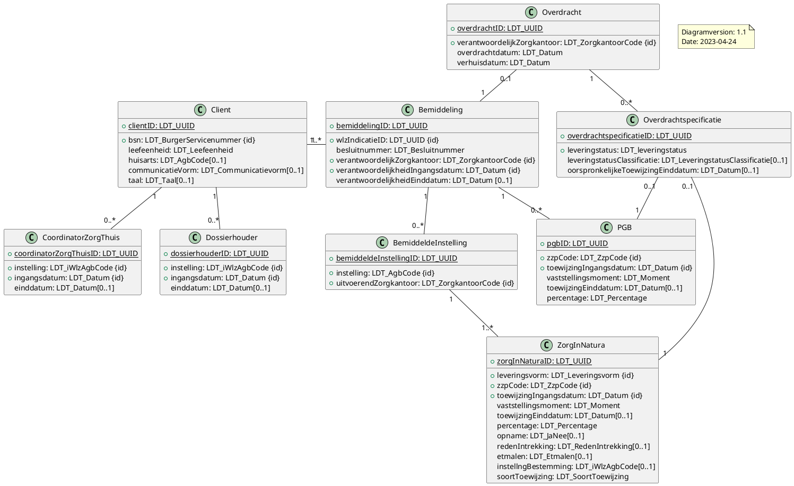

# iWlz-bemiddeling
Koppelvlak specificatie Bemiddelingsregister

> 
> **Status Koppelvlakspecificatie:** *in ontwikkeling* 
>
> d.d. 23 maart 2023
> 
> Het deel met de witte entiteiten (over de bemiddeling) is meerdere malen besproken in verschillende werkgroepen. **Status:** *STABIEL*
> 
> De roze gemarkeerde entiteiten gaan over de contactgegevens en contactpersoongegevens van een client. **Status:** * REVIEW* 

## Versies
Laatste versie: 

Versie overzicht zie: [Changelog](CHANGELOG.md)

## Documentatie
De specificaties zijn gebaseerd op het volgende ERD - versie 22-03-2023:

Informatiemodel iStandaarden iWlz 2.4: [Informatiemodellen](https://informatiemodellen.istandaarden.nl/)

## Bronnen
* Actieprogramma iWlz: van keten naar netwerk: [lees hier meer over het Actieprogramma iWlz](https://www.istandaarden.nl/actieprogramma-iwlz "Actieprogramma iWlz")
* Portaal voor iStandaarden in de Zorg en Ondersteuning: [homepagina iStandaarden](https://www.istandaarden.nl)

## Contactpersonen:
* Hilko Jacobse - [@hilkojacobse](https://github.com/HilkoJacobse)
* Remo van Rest - [@rvanrest](https://github.com/rvanrest)

## Licentie
Copyright &copy; iStandaarden 2021
Licensed under the [EUPL]

## nieuwe ERD
