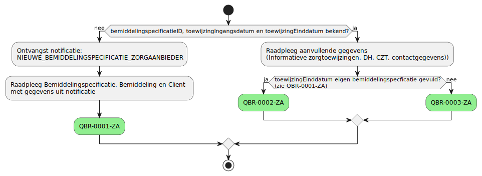
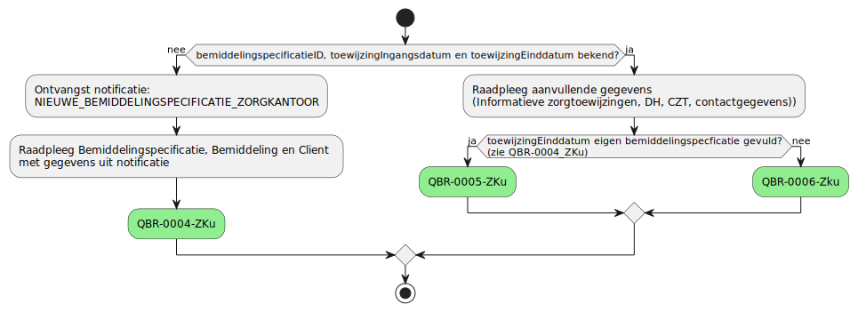

# GraphQL-query templates Bemiddelingsregister
Hier staan de query templates die een raadpleger kan gebruiken voor het raadplegen van gegevens in het Bemiddelingsregister. De templates dienen als voorbeeld hoe de query opgebouwd moet worden. De structuur en bepaalde verplichte parameters zijn nodig om te voldoen aan de autorisatie-policies. Doet een raadpleger dat niet dan kan de vraag niet afgehandeld worden. Bijvoorbeeld doordat de raadpleger benodigde input vergeet mee te geven, gegevens wil raadplegen die niet horen bij de raadpleger of omdat er meer gegevens worden geraadpleegd dan is toegestaan op dat moment. 

Een vraag wordt gesteld door een actor als deelnemer van het netwerk. Deze deelnemer stelt de vraag vanuit een bepaalde rol. Afhankelijk van de rol zijn gegevens wel of niet (direct) raadpleegbaar. 

Op dit moment zijn de volgende rollen onderkent:
| Deelnemer | rol | toelichting |
| :-- | :-- |:-- |
| Zorgaanbieder | [uitvoerend](#zorgaanbieder---uitvoerend) | Een zorgaanbieder die betrokken is bij de uitvoering van zorg |
| Zorgaanbieder | [dossierhouder](#zorgaanbieder---dossierhouder) | Een zorgaanbieder die verantwoordelijk is voor de uitvoering van verblijfszorg |
| Zorgaanbieder | [coordinator zorg thuis](#zorgaanbieder---coordinator-zorg-thuis) | Een zorgaanbieder die verantwoordelijk is voor de uitvoering van zorg thuis (mpt) | 
| Zorgkantoor | [verantwoordelijk](#zorgkantoor---verantwoordelijk) | Een zorgkantoor die verantwoordelijk is van de client (i.c.m. de Wlz Indicatie) en zorgt voor de registratie van die gegevens in het bemiddelingsregister | 
| Zorgkantoor | [uitvoerend](#zorgkantoor---uitvoerend) | Een zorgkantoor dat uitvoerend is betrokken bij de uitvoering van zorg i.v.m. zorg uit een andere regio | 
| Zorgkantoor | [nieuw verantwoordelijk](#zorgkantoor---nieuw-verantwoordelijk) | Het zorgkantoor dat de client krijgt overgedragen van het huidige verantwoordelijk zorgkantoor |
_De lijst is nog niet volledig._
< documentatie aanvullen >

## Beschikbare templates per rol

### Zorgaanbieder - uitvoerend
Na ontvangst van de notificatie: *NIEUWE_BEMIDDELINGSPECIFICATIE_ZORGAANBIEDER* of ad-hoc om complete toewijzing te raadplegen.

| **Query ID** | **Beschrijving** | **Verplichte input** | **resultaat** | **Autorisatie** |
|---|---|---|---|---|
| [**QBR-0001-ZA**](zorgaanbieder/QBR-0001-ZA.graphql) | Op basis van de (ontvangen) bemiddelingspecificatieID en eigen identificatie, de bijbehorende Bemiddelingspecificatie, Bemiddeling en Cliënt gegevens raadplegen | bemiddelingspecificatieID (V),  AGBcode (V) | Bemiddelingspecificatie /  Bemiddeling /  Client | BRA0001 |
| [**QBR-0002-ZA**](zorgaanbieder/QBR-0002-ZA.graphql) | Op basis van de bemiddelingsspecificatieID, eigen identificatie en toewijzingIngangdatum en toewijzingeinddatum, de (overlappende) Bemiddelingspecificatie(s), Bemiddeling, Client, Dossierhouder, CoordinatorZorgThuis, Contactpersoon en Contactgegevens raadplegen | bemiddelingspecificatieID (V),  AGBcode (V), toewijzingIngangsdatum (V), toewijzingEinddatum(V) | Bemiddelingspecificatie /  Bemiddeling /  Client /  Dossierhouder /  Coordinator zorg thuis /  Contactgegevens | BRA0002, BRA0004, BRA0005 |
| [**QBR-0003-ZA**](zorgaanbieder/QBR-0003.graphql) | Op basis van de bemiddelingsspecificatieID, eigen identificatie en toewijzingIngangdatum, de (overlappende) Bemiddelingspecificatie(s), Bemiddeling, Client, Dossierhouder, CoordinatorZorgThuis, Contactpersoon en Contactgegevens raadplegen | bemiddelingspecificatieID (V),  AGBcode (V), toewijzingIngangsdatum (V) | Bemiddelingspecificatie /  Bemiddeling /  Client /  Dossierhouder /  Coordinator zorg thuis /  Contactgegevens | BRA0002, BRA0004, BRA0005 |

### Zorgaanbieder - dossierhouder
Na ontvangst van de notificatie: _ROL_DOSSIERHOUDER_ZORGAANBIEDER_

| **Query ID** | **Beschrijving** | **Verplichte input** | **resultaat** | **Autorisatie** |
|---|---|---|---|---|

### Zorgaanbieder - coordinator zorg thuis
Na ontvangst van de notificatie: _ROL_COORDINATORZORGTHUIS_ZORGAANBIEDER_

| **Query ID** | **Beschrijving** | **Verplichte input** | **resultaat** | **Autorisatie** |
|---|---|---|---|---|

### Zorgkantoor - verantwoordelijk
Na de ontvangst van de notificatie: *NIEUWE_INDICATIE_ZORGKANTOOR*. Deze notificatie is afkomstig van het CIZ en geeft aan dat een client uit de regio van het zorgkantoor een (nieuwe) Wlz Indicatie heeft ontvangen. Met gegevens kan het zorgkantoor de indicatie raadplegen en bemiddeling registreren in het Bemiddelingsregister. Hieruit volgen weer nieuwe notificaties. 

| **Query ID** | **Beschrijving** | **Verplichte input** | **resultaat** | **Autorisatie** |
|---|---|---|---|---|

### Zorgkantoor - uitvoerend
Na ontvangst van de notificatie: *NIEUWE_BEMIDDELINGSPECIFICATIE_ZORGKANTOOR* of ad-hoc om complete toewijzing te raadplegen.

| **Query ID** | **Beschrijving** | **Verplichte input** | **resultaat** | **Autorisatie** |
|---|---|---|---|---|
| [**QBR-0004-ZKu**](zorgkantoor/QBR-0004-ZKu.graphql) | Op basis van de (ontvangen) bemiddelingspecificatieID en eigen identificatie, de bijbehorende Bemiddelingspecificatie, Bemiddeling en Cliënt gegevens raadplegen | bemiddelingspecificatieID (V),  Uzovicode (V) | Bemiddelingspecificatie /  Bemiddeling /  Client | BRA0006 |
| [**QBR-0005-ZKu**](zorgkantoor/QBR-0005-ZKu.graphql) | Op basis van de bemiddelingsspecificatieID, eigen identificatie en toewijzingIngangdatum en toewijzingeinddatum, de (overlappende) Bemiddelingspecificatie(s), Bemiddeling, Client, Dossierhouder, CoordinatorZorgThuis, Contactpersoon en Contactgegevens raadplegen | bemiddelingspecificatieID (V),  Uzovicode (V), Ingangsdatum bemiddelingsspecificatie (V), Einddatum (V) | Bemiddelingspecificatie /  Bemiddeling /  Client /  Dossierhouder /  Coordinator zorg thuis /  Contactgegevens | BRA0007, BRA0008, BRA0009 |
| [**QBR-0006-ZKu**](zorgkantoor/QBR-0006-ZKu.graphql) Bemiddeling, Client, Dossierhouder, CoordinatorZorgThuis, Contactpersoon en Contactgegevens raadplegen | bemiddelingspecificatieID (V),  Uzovicode (V), Ingangsdatum bemiddelingsspecificatie (V), | Bemiddelingspecificatie /  Bemiddeling /  Client /  Dossierhouder /  Coordinator zorg thuis /  Contactgegevens | BRA0007, BRA0008, BRA0009 |

### Zorgkantoor - nieuw verantwoordelijk
Na ontvangst van de notificatie: *OVERDRACHT_ZORGKANTOOR*

| **Query ID** | **Beschrijving** | **Verplichte input** | **resultaat** | **Autorisatie** |
|---|---|---|---|---|
