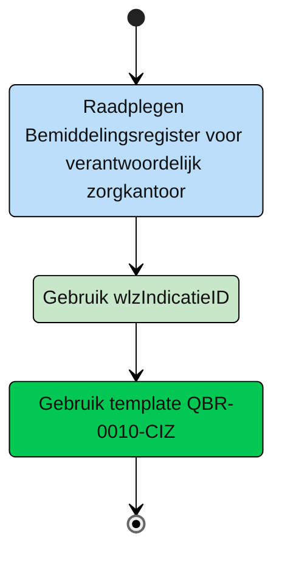

# CIZ
| Deelnemer | rol | toelichting |
| :-- | :-- |:-- |
| CIZ | [notificatie](#ciz---notificatie) | Het CIZ raadpleegt het Bemiddelingsregister voor het informeren van alle betrokken verantwoordelijk zorgkantoren van wijzigingen op een Wlz Indicatie | 

## CIZ - notificatie 

**Schematisch:**

| **Query ID** | **Beschrijving** | **Verplichte input** | **resultaat** | **Autorisatie** |
|---|---|---|---|---|
| [QBR-0010-CIZ](/gql-query/ciz/QBR-0010-CIZ.graphql) | Raadplegen bij Wlz Indicatie betrokken verantwoordelijke zorgkantoren | wlzIndicatieID | Alle bij een Wlz Indicatie betrokken verantwoordelijke zorgkantoren | [BRA0011](https://informatiemodel.istandaarden.nl/informatiemodel/iwlz/netwerk/bemiddelingsregister-1/regels/autorisatieregel/bra0011/)