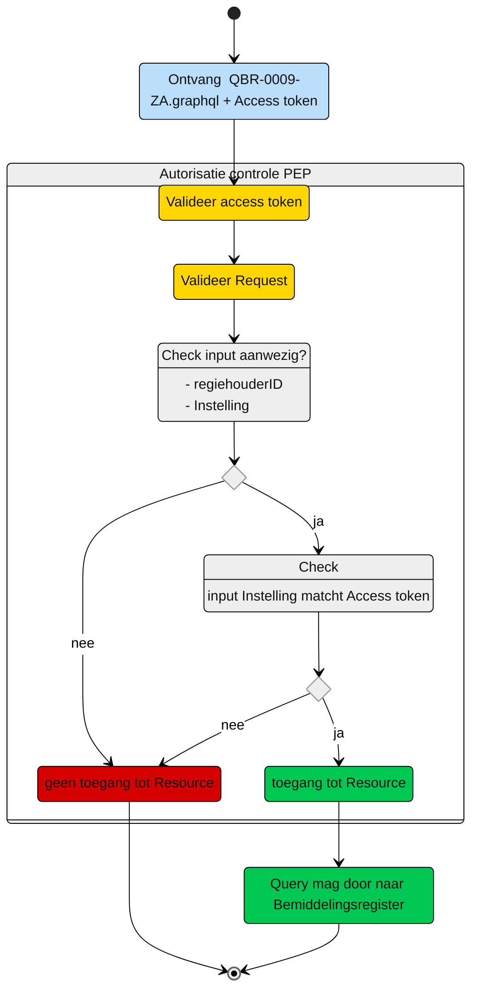

# Autorisatie-flow Zorgaanbieder: QBR-0009-ZA.graphql

Beschrijving van het autorisatieproces door de PEP, voor query [QBR-0009-ZA.graphql](/gql-query/zorgaanbieder/QBR-0009-ZAr.graphql)

**schematisch:**



Controle query PIP:
```gql
niet van toepassing

```


---
[Terug naar Query overzicht](/gql-query/README.md)