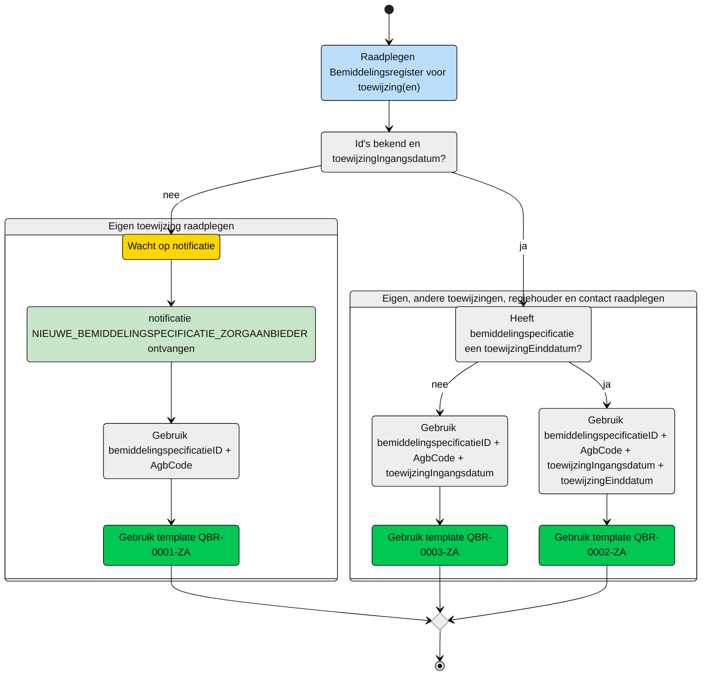
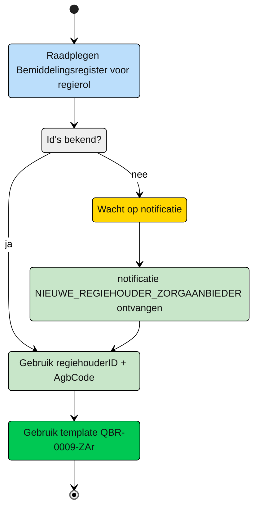

# Query-templates voor de zorgaanbieder
Op dit moment zijn de volgende rollen onderkent:
| Deelnemer | rol | toelichting |
| :-- | :-- |:-- |
| Zorgaanbieder | [uitvoerend](#zorgaanbieder---uitvoerend) | Een zorgaanbieder die betrokken is bij de uitvoering van zorg |
| Zorgaanbieder | [regiehouder](#zorgaanbieder---regiehouder) | Een zorgaanbieder die verantwoordelijk is voor de uitvoering van de zorg |


## Zorgaanbieder - uitvoerend
Een zorgaanbieder wordt bij de zorg van een client betrokken door het zorgkantoor. Het zorgkantoor registreert een bemiddelingspecificatie (toewijzing) voor het leveren van zorg door de zorgaanbieder. De zorgaanbieder ontvangt hiervan een notificatie ```NIEUWE_BEMIDDELINGSPECIFICATIE_ZORGAANBIEDER```. Op basis van deze notificatie kan de zorgaanbieder de informatie in het Bemiddelingregister raadplegen. 

> [!NOTE]
> Voor het volledige beeld moeten er altijd 2 bevragingen worden uitgevoerd.
> Te beginnen met QBR0001ZA voor het ophalen van de periode en vervolgens één van de twee andere queries. 


**schematisch:**



| **Query ID** | **Beschrijving** | **Verplichte input** | **resultaat** | **Autorisatie** |
|---|---|---|---|---|
| [**QBR-0001-ZA**](zorgaanbieder/QBR-0001-ZA.graphql) | Op basis van de (ontvangen) bemiddelingspecificatieID en eigen identificatie, de bijbehorende Bemiddelingspecificatie, Bemiddeling en Cliënt gegevens raadplegen | bemiddelingspecificatieID (V),  AGBcode (V) | Bemiddelingspecificatie /  Bemiddeling /  Client | [BRA0001](https://informatiemodel.istandaarden.nl/informatiemodel/iwlz/netwerk/bemiddelingsregister-1/regels/autorisatieregel/bra0001/) |
| [**QBR-0002-ZA**](zorgaanbieder/QBR-0002-ZA.graphql) | Op basis van de bemiddelingsspecificatieID, eigen identificatie en toewijzingIngangdatum en toewijzingeinddatum, de (overlappende) Bemiddelingspecificatie(s), Bemiddeling, Client, Dossierhouder, CoordinatorZorgThuis, Contactpersoon en Contactgegevens raadplegen | bemiddelingspecificatieID (V),  AGBcode (V), toewijzingIngangsdatum (V), toewijzingEinddatum(V) | Bemiddelingspecificatie /  Bemiddeling /  Client /  Dossierhouder /  Coordinator zorg thuis /  Contactgegevens | [BRA0002](https://informatiemodel.istandaarden.nl/informatiemodel/iwlz/netwerk/bemiddelingsregister-1/regels/autorisatieregel/bra0002/), [BRA0004](https://informatiemodel.istandaarden.nl/informatiemodel/iwlz/netwerk/bemiddelingsregister-1/regels/autorisatieregel/bra0004/), [BRA0005](https://informatiemodel.istandaarden.nl/informatiemodel/iwlz/netwerk/bemiddelingsregister-1/regels/autorisatieregel/bra0005/) |
| [**QBR-0003-ZA**](zorgaanbieder/QBR-0003.graphql) | Op basis van de bemiddelingsspecificatieID, eigen identificatie en toewijzingIngangdatum, de (overlappende) Bemiddelingspecificatie(s), Bemiddeling, Client, Dossierhouder, CoordinatorZorgThuis, Contactpersoon en Contactgegevens raadplegen | bemiddelingspecificatieID (V),  AGBcode (V), toewijzingIngangsdatum (V) | Bemiddelingspecificatie /  Bemiddeling /  Client /  Dossierhouder /  Coordinator zorg thuis /  Contactgegevens | [BRA0002](https://informatiemodel.istandaarden.nl/informatiemodel/iwlz/netwerk/bemiddelingsregister-1/regels/autorisatieregel/bra0002/), [BRA0004](https://informatiemodel.istandaarden.nl/informatiemodel/iwlz/netwerk/bemiddelingsregister-1/regels/autorisatieregel/bra0004/), [BRA0005](https://informatiemodel.istandaarden.nl/informatiemodel/iwlz/netwerk/bemiddelingsregister-1/regels/autorisatieregel/bra0005/) |

## Zorgaanbieder - regiehouder
Een zorgaanbieder kan regiehouder zijn van een client. Als de zorgaanbieder een regierol krijgt aangewezen, ontvangt die zorgaanbieder daar de notificatie ```NIEUWE_REGIEHOUDER_ZORGAANBIEDER``` van.

**Schematisch:**



| **Query ID** | **Beschrijving** | **Verplichte input** | **resultaat** | **Autorisatie** |
|---|---|---|---|---|
| [**QBR-0009-ZAr**](zorgaanbieder/QBR-0009-ZAr.graphql) |  | regiehouderID, AGBcode | Regiehouder / Bemiddeling / Client | [BRA0012](https://informatiemodel.istandaarden.nl/informatiemodel/iwlz/netwerk/bemiddelingsregister-1/regels/autorisatieregel/bra0012/) |
