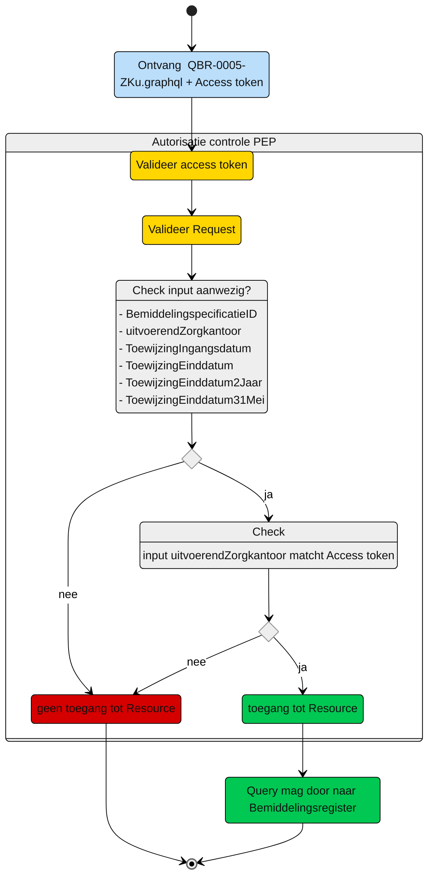

# Autorisatie-flow Zorgaanbieder: QBR-0005-ZKu.graphql

Beschrijving van het autorisatieproces door de PEP, voor query [QBR-0005-ZKu.graphql](/gql-query/zorgkantoor/QBR-0005-ZKu.graphql).

**schematisch:**



Controle query PIP:
```gql
niet van toepassing

```


---
[Terug naar Query overzicht](/gql-query/README.md)