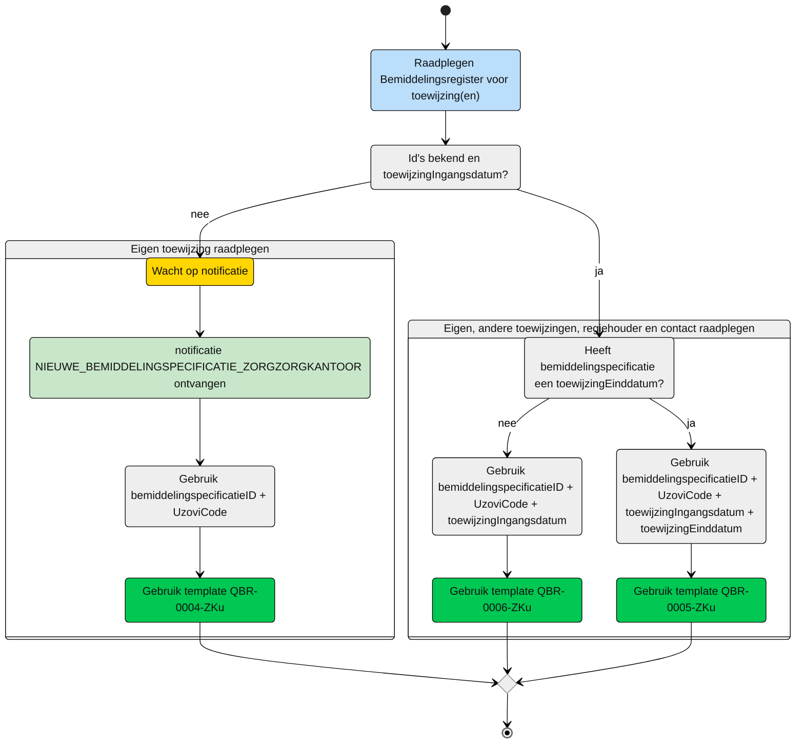
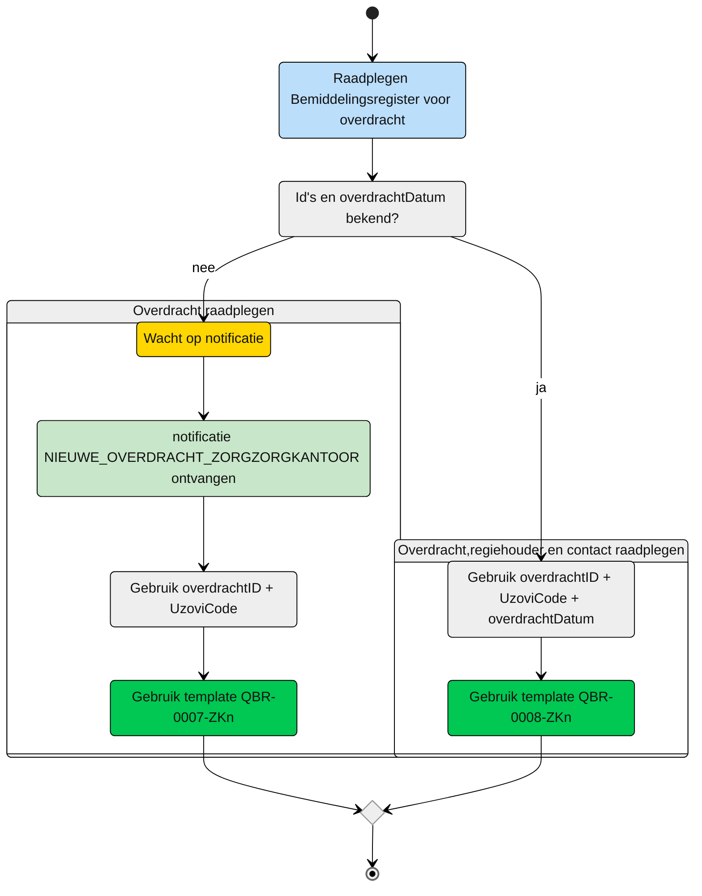

# ZORGKANTOOR

Op dit moment zijn de volgende rollen onderkent:
| Deelnemer | rol | toelichting |
| :-- | :-- |:-- |
| Zorgkantoor | [verantwoordelijk](#zorgkantoor---verantwoordelijk) | Een zorgkantoor die verantwoordelijk is van de client (i.c.m. de Wlz Indicatie) en zorgt voor de registratie van die gegevens in het bemiddelingsregister | 
| Zorgkantoor | [uitvoerend](#zorgkantoor---uitvoerend) | Een zorgkantoor dat uitvoerend is betrokken bij de uitvoering van zorg i.v.m. zorg uit een andere regio | 
| Zorgkantoor | [nieuw verantwoordelijk](#zorgkantoor---nieuw-verantwoordelijk) | Het zorgkantoor dat de client krijgt overgedragen van het huidige verantwoordelijk zorgkantoor |

## Zorgkantoor - verantwoordelijk
Het verantwoordelijke zorgkantoor is eigenaar van de eigen gegevens en mag daarom alle gegevens van het eigen zorgkantoor raadplegen zonder beperking. 

Na de ontvangst van de notificatie: *NIEUWE_INDICATIE_ZORGKANTOOR*. Deze notificatie is afkomstig van het CIZ en geeft aan dat een client uit de regio van het zorgkantoor een (nieuwe) Wlz Indicatie heeft ontvangen. Met gegevens kan het zorgkantoor de indicatie raadplegen en bemiddeling registreren in het Bemiddelingsregister. Hieruit volgen weer nieuwe notificaties. 

Zie voor de query-template voor het opvragen van de Indicatie de repository van het [Koppelvlak Indicatieregister](https://github.com/iStandaarden/iWlz-indicatie).

## Zorgkantoor - uitvoerend
Het uitvoerend zorgkantoor kan gelijk zijn aan het verantwoordelijk zorgkantoor. In dat geval is het uitvoerende zorgkantoor het regionaal verantwoordelijke zorgkantoor en heeft daarom altijd toegang tot de informatie. 

Wanneer er sprake is van een *bovenregionaal* uitvoerend zorgkantoor omdat er door het regionale zorgkantoor zorg is toegewezen aan aanbieder die valt onder de verantwoordelijkheid van het bovenregionale zorgkantoor, is toegang via onderstaande flow. 

> [!NOTE]
> Voor het volledige beeld moeten er altijd 2 bevragingen worden uitgevoerd.
> Te beginnen met QBR-0004-ZKu voor het ophalen van de periode en vervolgens één van de twee andere queries. 

**schematisch:**

| **Query ID** | **Beschrijving** | **Verplichte input** | **Resultaat** | **Autorisatie** | **Autorisatie flow** |
|---|---|---|---|---|---|
| [**QBR-0004-ZKu**](zorgkantoor/QBR-0004-ZKu.graphql) | Op basis van de (ontvangen) bemiddelingspecificatieID en eigen identificatie, de bijbehorende Bemiddelingspecificatie, Bemiddeling en Cliënt gegevens raadplegen | bemiddelingspecificatieID (V),  Uzovicode (V) | Bemiddelingspecificatie /  Bemiddeling /  Client | [BRA0006](https://informatiemodel.istandaarden.nl/informatiemodel/iwlz/netwerk/bemiddelingsregister-1/regels/autorisatieregel/bra0006/) | [Autorisatie controle](/gql-query/zorgkantoor/QBR-0004-ZKu-autorisatie.md) |
| [**QBR-0005-ZKu**](zorgkantoor/QBR-0005-ZKu.graphql) | Op basis van de bemiddelingsspecificatieID, eigen identificatie en toewijzingingangsdatum en toewijzingeinddatum, de (overlappende) Bemiddelingspecificatie(s), Bemiddeling, Client, Dossierhouder, CoordinatorZorgThuis, Contactpersoon en Contactgegevens raadplegen | bemiddelingspecificatieID (V),  Uzovicode (V), Ingangsdatum bemiddelingsspecificatie (V), Einddatum (V) | Bemiddelingspecificatie /  Bemiddeling /  Client /  Regiehouder /  Contactgegevens | [BRA0007](https://informatiemodel.istandaarden.nl/informatiemodel/iwlz/netwerk/bemiddelingsregister-1/regels/autorisatieregel/bra0007/), [BRA0008](https://informatiemodel.istandaarden.nl/informatiemodel/iwlz/netwerk/bemiddelingsregister-1/regels/autorisatieregel/bra0008/), [BRA0009](https://informatiemodel.istandaarden.nl/informatiemodel/iwlz/netwerk/bemiddelingsregister-1/regels/autorisatieregel/bra0009/) | [Autorisatie controle](/gql-query/zorgkantoor/QBR-0005-ZKu-autorisatie.md) |
| [**QBR-0006-ZKu**](zorgkantoor/QBR-0006-ZKu.graphql) | Bemiddeling, Client, Dossierhouder, CoordinatorZorgThuis, Contactpersoon en Contactgegevens raadplegen | bemiddelingspecificatieID (V),  Uzovicode (V), Ingangsdatum bemiddelingsspecificatie (V), | Bemiddelingspecificatie /  Bemiddeling /  Client /  Regiehouder /  Contactgegevens | [BRA0007](https://informatiemodel.istandaarden.nl/informatiemodel/iwlz/netwerk/bemiddelingsregister-1/regels/autorisatieregel/bra0007/), [BRA0008](https://informatiemodel.istandaarden.nl/informatiemodel/iwlz/netwerk/bemiddelingsregister-1/regels/autorisatieregel/bra0008/), [BRA0009](https://informatiemodel.istandaarden.nl/informatiemodel/iwlz/netwerk/bemiddelingsregister-1/regels/autorisatieregel/bra0009/)  | [Autorisatie controle](/gql-query/zorgkantoor/QBR-0006-ZKu-autorisatie.md) |

## Zorgkantoor - nieuw verantwoordelijk
Na ontvangst van de notificatie: *OVERDRACHT_ZORGKANTOOR* of ad-hoc om complete overdracht te raadplegen.

> [!NOTE]
> Voor het volledige beeld moeten er altijd 2 bevragingen worden uitgevoerd.
> Te beginnen met QBR-0007-ZKn, waarmee de overdrachtdatum opgehaald kan worden en daarna QBR-0008-Zkn. 

**schematisch:**

| **Query ID** | **Beschrijving** | **Verplichte input** | **Resultaat** | **Autorisatie** | **Autorisatie flow** | 
|---|---|---|---|---|---|
| [**QBR-0007-ZKn**](zorgkantoor/QBR-0007-ZKn.graphql) | Op basis van de overdrachtID en eigen identificatie de overgedragen Bemiddeling, Bemiddelingspecificatie(s) en Client raadplegen | overdrachtID (V), uzovicode (V) | Overdracht / Overdrachtspecificatie / Bemiddeling / Bemiddelingspecificatie / Client | [BRA0010](https://informatiemodel.istandaarden.nl/informatiemodel/iwlz/netwerk/bemiddelingsregister-1/regels/autorisatieregel/bra0010/) | [Autorisatie controle](/gql-query/zorgkantoor/QBR-0007-ZKn-autorisatie.md) |
| [**QBR-0008-ZKn**](zorgkantoor/QBR-0008-ZKn.graphql) | Op basis van de overdrachtID eigen identificatie en overdrachtdatum de overgedragen Bemiddeling, Bemiddelingspecificatie(s), Regiehouder, Contactpersoon en Contactgegevens raadplegen | overdrachtID (V), uzovicode (V), overdrachtsdatum (V) | Overdracht Overdrachtspecificatie Bemiddeling Bemiddelingspecificatie Client Regiehouder Contactgegevens Contactpersoongegevens | [BRA0010](https://informatiemodel.istandaarden.nl/informatiemodel/iwlz/netwerk/bemiddelingsregister-1/regels/autorisatieregel/bra0010/) | [Autorisatie controle](/gql-query/zorgkantoor/QBR-0008-ZKn-autorisatie.md) |

---
[Terug naar Query overzicht](/gql-query/README.md)