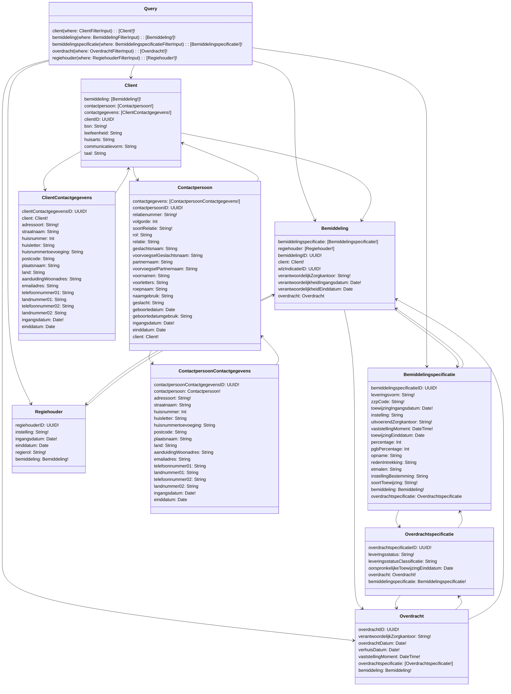

[Schema](/gql-specificatie/Bemiddelingregister.graphql)

```mermaid
classDiagram
  class Query{
    client(where: ClientFilterInput): [Client!]!
    bemiddeling(where: BemiddelingFilterInput): [Bemiddeling!]!
    bemiddelingspecificatie(where: BemiddelingspecificatieFilterInput): [Bemiddelingspecificatie!]!
    overdracht(where: OverdrachtFilterInput): [Overdracht!]!
    regiehouder(where: RegiehouderFilterInput): [Regiehouder!]!
    }
    
  Query --> Client
  Query --> Bemiddeling
  Query --> Bemiddelingspecificatie
  Query --> Regiehouder
  Query --> Overdracht
  
  class Client {
    bemiddeling: [Bemiddeling!]!
    contactpersoon: [Contactpersoon!]
    contactgegevens: [ClientContactgegevens!]
    clientID: UUID!
    bsn: String!
    leefeenheid: String
    huisarts: String
    communicatievorm: String
    taal: String
    }
  
  Client --> Bemiddeling
  Client --> Contactpersoon
  Client --> ClientContactgegevens
  
  class Bemiddeling{
    bemiddelingspecificatie: [Bemiddelingspecificatie!]
    regiehouder: [Regiehouder!]
    bemiddelingID: UUID!
    client: Client!
    wlzIndicatieID: UUID!
    verantwoordelijkZorgkantoor: String!
    verantwoordelijkheidIngangsdatum: Date!
    verantwoordelijkheidEinddatum: Date
    overdracht: Overdracht
    }
  
  Bemiddeling --> Bemiddelingspecificatie
  Bemiddeling --> Regiehouder
  Bemiddeling --> Overdracht
  
  class Bemiddelingspecificatie{
    bemiddelingspecificatieID: UUID!
    leveringsvorm: String!
    zzpCode: String!
    toewijzingIngangsdatum: Date!
    instelling: String
    uitvoerendZorgkantoor: String!
    vaststellingMoment: DateTime!
    toewijzingEinddatum: Date
    percentage: Int
    pgbPercentage: Int
    opname: String
    redenIntrekking: String
    etmalen: String
    instellingBestemming: String
    soortToewijzing: String!
    bemiddeling: Bemiddeling!
    overdrachtspecificatie: Overdrachtspecificatie
    }
  
  Bemiddelingspecificatie --> Bemiddeling
  Bemiddelingspecificatie --> Overdrachtspecificatie
  
  class Regiehouder{
    regiehouderID: UUID!
    instelling: String!
    ingangsdatum: Date!
    einddatum: Date
    regierol: String!
    bemiddeling: Bemiddeling!
    }
  
  Regiehouder --> Bemiddeling
  
  class Overdracht {
    overdrachtID: UUID!
    verantwoordelijkZorgkantoor: String!
    overdrachtDatum: Date!
    verhuisDatum: Date!
    vaststellingMoment: DateTime!
    overdrachtspecificatie: [Overdrachtspecificatie!]
    bemiddeling: Bemiddeling!
    }
  
  Overdracht --> Overdrachtspecificatie
  Overdracht --> Bemiddeling
  
  class Overdrachtspecificatie {
    overdrachtspecificatieID: UUID!
    leveringsstatus: String!
    leveringsstatusClassificatie: String
    oorspronkelijkeToewijzingEinddatum: Date
    overdracht: Overdracht!
    bemiddelingspecificatie: Bemiddelingspecificatie!
    }
  
  Overdrachtspecificatie --> Overdracht
  Overdrachtspecificatie --> Bemiddelingspecificatie
  
  class Contactpersoon {
    contactgegevens: [ContactpersoonContactgegevens!]
    contactpersoonID: UUID!
    relatienummer: String!
    volgorde: Int
    soortRelatie: String!
    rol: String
    relatie: String
    geslachtsnaam: String
    voorvoegselGeslachtsnaam: String
    partnernaam: String
    voorvoegselPartnernaam: String
    voornamen: String
    voorletters: String
    roepnaam: String
    naamgebruik: String
    geslacht: String
    geboortedatum: Date
    geboortedatumgebruik: String
    ingangsdatum: Date!
    einddatum: Date
    client: Client!
    }
  
  Contactpersoon --> Client
  Contactpersoon --> ContactpersoonContactgegevens
  
  class ClientContactgegevens {
    clientContactgegevensID: UUID!
    client: Client!
    adressoort: String!
    straatnaam: String
    huisnummer: Int
    huisletter: String
    huisnummertoevoeging: String
    postcode: String
    plaatsnaam: String
    land: String
    aanduidingWoonadres: String
    emailadres: String
    telefoonnummer01: String
    landnummer01: String
    telefoonnummer02: String
    landnummer02: String
    ingangsdatum: Date!
    einddatum: Date
    }
  
  ClientContactgegevens --> Client
  
  class ContactpersoonContactgegevens {
    contactpersoonContactgegevensID: UUID!
    contactpersoon: Contactpersoon!
    adressoort: String!
    straatnaam: String
    huisnummer: Int
    huisletter: String
    huisnummertoevoeging: String
    postcode: String
    plaatsnaam: String
    land: String
    aanduidingWoonadres: String
    emailadres: String
    telefoonnummer01: String
    landnummer01: String
    telefoonnummer02: String
    landnummer02: String
    ingangsdatum: Date!
    einddatum: Date
    }
  
  ContactpersoonContactgegevens --> Contactpersoon
```

