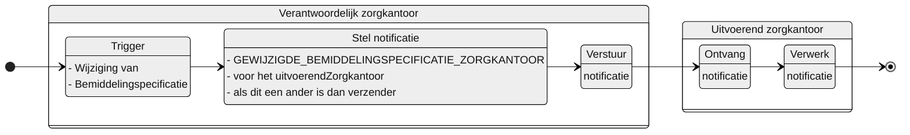

# GEWIJZIGDE_BEMIDDELINGSPECIFICATIE_ZORGKANTOOR

## Documentatie

Notificatie aan het uitvoerende zorgkantoor als het verantwoordelijke zorgkantoor een nieuwe Bemiddelingspecificatie voor een gecontracteerde zorgaanbieder (van dit uitvoerende zorgkantoor) heeft gewijzigd.

Het uitvoerende (bovenregionale) zorgkantoor is daarmee geïnformeerd over een wijziging van een bemiddelingsspecificatie voor een gecontracteerde zorgaanbieder. De notificatie bevat informatie waarmee dat zorgkantoor de Bemiddelingspecificatie kan raadplegen.

## Aanleiding
**De trigger voor de notificatie is:** 

> de wijziging van een Bemiddelingspecificatie in het Bemiddelingsregister

## Instructie
**Stel notificatie op voor:** 
> het zorgkantoor dat geregistreerd is onder uitvoerend zorgkantoor in de Bemiddelingspecificatie als dit een ander is dan het verantwoordelijke (verzendende) zorgkantoor zelf.

## Type
Het type-notificatie: 
> VERPLICHT

## Schematisch




## Inhoud van de notificatie

| Variabele | Waarde | Voorbeeld | 
| :-- | :-- | :-- |
| timestamp | {timestamp} | ```"timestamp": "2024-07-02T00:00:00Z"``` | 
| afzenderIDType | "UZOVI" | ```"afzenderIDType": "UZOVI"``` |
| afzenderID | {uzovi-code ontvanger} | ```"afzenderID": "5050"``` |
| ontvangerIDType | "UZOVI" | ```"ontvangerIDType": "UZOVI"``` |
| ontvangerID | {uzovi-code ontvanger} | ```"ontvangerID": "5151"``` |
| ontvangerKenmerk | NULL | |
| eventType | "GEWIJZIGDE_BEMIDDELINGSPECIFICATIE_ZORGKANTOOR" | ```"eventType": "GEWIJZIGDE_BEMIDDELINGSPECIFICATIE_ZORGKANTOOR"``` |
| subjectList |  | ```"subjectList": [{```|
| ../subject | "Bemiddeling/{bemiddelingID}" | "subject": "Bemiddeling/ef88ce35-58fa-4e6d-ac7a-6e298dd211d6"|
| ../recordID | "Bemiddelingspecificatie/{bemiddelingspecificatieID}" | "recordID": "Bemiddelingspecificatie/ef88ce35-58fa-4e6d-ac7a-6e298dd211d6" |
| | | ```}]``` | 


## Andere notificaties Bemiddelingsregister
[Andere notificaties Bemiddelingsregister](README.md)

## Meer informatie over Notificaties

Meer informatie over notificeren in het [Afsprakenstelsel iWlz](https://wlz.atlassian.net/wiki/x/5AlgAQ?atlOrigin=eyJpIjoiNzMyN2E3MjM3YjQwNGQ4MmFkZDgwNWY0ZmE0MDIzMGEiLCJwIjoiYyJ9): [link](https://wlz.atlassian.net/wiki/x/5AlgAQ?atlOrigin=eyJpIjoiNzMyN2E3MjM3YjQwNGQ4MmFkZDgwNWY0ZmE0MDIzMGEiLCJwIjoiYyJ9)
