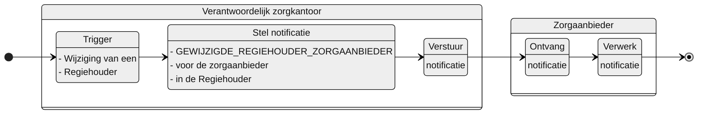

# GEWIJZIGDE_REGIEHOUDER_ZORGAANBIEDER

## Documentatie

Notificatie aan de zorgaanbieder als het verantwoordelijke zorgkantoor de regieperiode van deze zorgaanbieder heeft gewijzigd.   

De zorgaanbieder is daarmee geïnformeerd over de wijziging in de periode van een regierol door het verantwoordelijk zorgkantoor. De notificatie bevat informatie waarmee de zorgaanbieder de Regiehouder (en regierol) kan raadplegen.

## Aanleiding
**De trigger voor de notificatie is:** 

> de wijziging van een Regiehouder in het Bemiddelingsregister

## Instructie
**Stel notificatie op voor:** 
> de zorgaanbieder die geregistreerd is onder instelling in de gewijzigde Regiehouder.

## Type
Het type-notificatie: 
> VERPLICHT

## Schematisch




## Inhoud van de notificatie

| Variabele | Waarde | Voorbeeld | 
| :-- | :-- | :-- |
| timestamp | {timestamp} | ```"timestamp": "2024-07-02T00:00:00Z"``` | 
| afzenderIDType | "UZOVI" | ```"afzenderIDType": "UZOVI"``` |
| afzenderID | {uzovi-code ontvanger} | ```"afzenderID": "5050"``` |
| ontvangerIDType | "AGBCODE" | ```"ontvangerIDType": "AGBCODE"``` |
| ontvangerID | {uzovi-code ontvanger} | ```"ontvangerID": "12345678"``` |
| ontvangerKenmerk | NULL | |
| eventType | "GEWIJZIGDE_REGIEHOUDER_ZORGAANBIEDER" | ```"eventType": "GEWIJZIGDE_REGIEHOUDER_ZORGAANBIEDER"``` |
| subjectList |  | ```"subjectList": [{```|
| ../subject | "Bemiddeling/{bemiddelingID}" | "subject": "Bemiddeling/ef88ce35-58fa-4e6d-ac7a-6e298dd211d6"|
| ../recordID | "Regiehouder/{regiehouderID}" | "recordID": "Regiehouder/ef88ce35-58fa-4e6d-ac7a-6e298dd211d6" |
| | | ```}]``` | 


## Andere notificaties Bemiddelingsregister
[Andere notificaties Bemiddelingsregister](README.md)

## Meer informatie over Notificaties

Meer informatie over notificeren in het [Afsprakenstelsel iWlz](https://wlz.atlassian.net/wiki/x/5AlgAQ?atlOrigin=eyJpIjoiNzMyN2E3MjM3YjQwNGQ4MmFkZDgwNWY0ZmE0MDIzMGEiLCJwIjoiYyJ9): [link](https://wlz.atlassian.net/wiki/x/5AlgAQ?atlOrigin=eyJpIjoiNzMyN2E3MjM3YjQwNGQ4MmFkZDgwNWY0ZmE0MDIzMGEiLCJwIjoiYyJ9)
