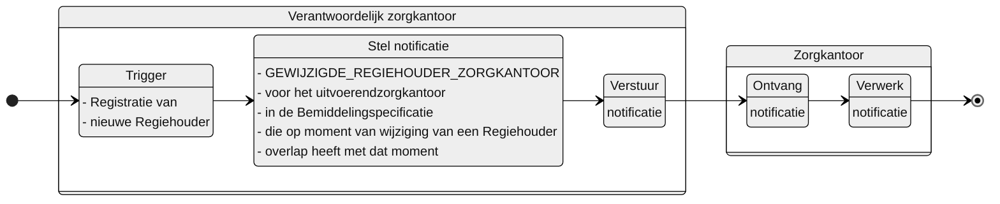

# GEWIJZIGDE_REGIEHOUDER_ZORGKANTOOR

## Documentatie

Notificatie aan het uitvoerende zorgkantoor dat op het moment dat het verantwoordelijke zorgkantoor een `Regiehouder` heeft gewijzigd een actuele `Bemiddelingsspecificatie` heeft.

Het uitvoerende zorgkantoor is dan geïnformeerd over de wijziging van een regierol aan een zorgaanbieder door het verantwoordelijk zorgkantoor. De notificatie bevat informatie waarmee het zorgkantoor de Regiehouder (en regierol) kan raadplegen.

## Aanleiding
**De trigger voor de notificatie is:** 

> de wijziging van een Regiehouder in het Bemiddelingsregister

## Instructie
**Stel notificatie op voor:** 
> voor elk uitvoerende zorgkantoor (`Bemiddelingspecificatie.uitvoerendZorgkantoor`) met een Bemiddelingspecificatie waarvan de ingangsdatum (`Bemiddelingspecificatie.toewijzingIngangsdatum`) (of eerder vaststellingsmoment (`Bemiddelingspecificatie.vaststellingMoment`)) voor of gelijk aan en de einddatum (`Bemiddelingspecificatie.toewijzingEinddatum`) na het moment van wijziging van de regiehouder ligt.

## Type
Het type-notificatie: 
> VERPLICHT (*zolang er geen abonnementenregistratie beschikbaar is*)

## Schematisch




## Inhoud van de notificatie

| Variabele | Waarde | Voorbeeld | 
| :-- | :-- | :-- |
| timestamp | {timestamp} | ```"timestamp": "2024-07-02T00:00:00.000Z"``` | 
| afzenderIDType | "UZOVI" | ```"afzenderIDType": "UZOVI"``` |
| afzenderID | {uzovi-code afzender} | ```"afzenderID": "5050"``` |
| ontvangerIDType | "UZOVI" | ```"afzenderIDType": "UZOVI"``` |
| ontvangerID | {uzovi-code ontvanger} | ```"afzenderID": "5151"``` |
| ontvangerKenmerk | NULL | |
| eventType | "GEWIJZIGDE_REGIEHOUDER_ZORGKANTOOR" | ```"eventType": "GEWIJZIGDE_REGIEHOUDER_ZORGKANTOOR"``` |
| subjectList |  | ```"subjectList": [{```|
| ../subject | "Bemiddeling/{bemiddelingID}" | "subject": "Bemiddeling/ef88ce35-58fa-4e6d-ac7a-6e298dd211d6"|
| ../recordID | "Regiehouder/{regiehouderID}" | "recordID": "Regiehouder/ef88ce35-58fa-4e6d-ac7a-6e298dd211d6" |
| | | ```}]``` | 


## Andere notificaties Bemiddelingsregister
[Andere notificaties Bemiddelingsregister](README.md)

## Meer informatie over Notificaties

Meer informatie over notificeren in het [Afsprakenstelsel iWlz](https://wlz.atlassian.net/wiki/x/5AlgAQ?atlOrigin=eyJpIjoiNzMyN2E3MjM3YjQwNGQ4MmFkZDgwNWY0ZmE0MDIzMGEiLCJwIjoiYyJ9): [link](https://wlz.atlassian.net/wiki/x/5AlgAQ?atlOrigin=eyJpIjoiNzMyN2E3MjM3YjQwNGQ4MmFkZDgwNWY0ZmE0MDIzMGEiLCJwIjoiYyJ9)
