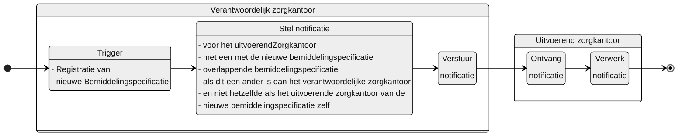

# INFORMATIEVE_NIEUWE_BEMIDDELINGSPECIFICATIE_ZORGKANTOOR

## Documentatie

Notificatie aan het uitvoerende zorgkantoor als het verantwoordelijke zorgkantoor een nieuwe Bemiddelingspecificatie  heeft geregistreerd ,die niet voor dat uitvoerende zorgkantoor is of voor het verantwoordelijke zorgkantoor zelf.

Het uitvoerende (bovenregionale) zorgkantoor is daarmee informatief geïnformeerd over de registratie van een nieuwe bemiddelingsspecificatie, naast een overlappende bemiddelingspecificatie van dat zorgkantoor zelf.*

De notificatie bevat informatie waarmee dat zorgkantoor de Bemiddelingspecificatie kan raadplegen.

## Aanleiding
**De trigger voor de notificatie is:** 

> de registratie van een Bemiddelingspecificatie in het Bemiddelingsregister

## Instructie
**Stel notificatie op voor:** <br/>elk uitvoerende zorgkantoor (`Bemiddelingspecificatie.uitvoerendZorgkantoor`) met een Bemiddelingspecificatie waarvan op het moment van registratie van de nieuwe Bemiddelingspecificatie: <br/> <ol><li>de toewijzingIngangsdatum  (of eerder vaststellingMoment) van de eigen bemiddelingspecificatie voor of gelijk is aan de toewijzingEinddatum (of later vaststellingMoment) van de nieuwe bemiddelingspecificatie en <br/> <li/> de toewijzingEinddatum van de eigen bemiddelingspecificatie na of gelijk is aan de toewijzingIngangsdatum (of eerder vaststellingMoment) van de nieuwe bemiddelingspecificatie.<li/>en de toewijzingEinddatum van de eigen Bemiddelingspecificatie kleiner of gelijk is aan  31 mei van het jaar dat volgt op de einddatum van die eigen Bemiddelingspecificatie.</ol> 

## Type
Het type-notificatie: 
> VERPLICHT (*zolang er geen abonnementenregistratie beschikbaar is*)

## Schematisch




## Inhoud van de notificatie

| Variabele | Waarde | Voorbeeld | 
| :-- | :-- | :-- |
| timestamp | {timestamp} | ```"timestamp": "2024-07-02T00:00:00.000Z"``` | 
| afzenderIDType | "UZOVI" | ```"afzenderIDType": "UZOVI"``` |
| afzenderID | {uzovi-code afzender} | ```"afzenderID": "5050"``` |
| ontvangerIDType | "UZOVI" | ```"ontvangerIDType": "UZOVI"``` |
| ontvangerID | {uzovi-code ontvanger} | ```"ontvangerID": "5151"``` |
| ontvangerKenmerk | NULL | |
| eventType | "INFORMATIEVE_NIEUWE_BEMIDDELINGSPECIFICATIE_ZORGKANTOOR" | ```"eventType": "INFORMATIEVE_NIEUWE_BEMIDDELINGSPECIFICATIE_ZORGKANTOOR"``` |
| subjectList |  | ```"subjectList": [{```|
| ../subject | "Bemiddeling/{bemiddelingID}" | "subject": "Bemiddeling/ef88ce35-58fa-4e6d-ac7a-6e298dd211d6"|
| ../recordID | "Bemiddelingspecificatie/{bemiddelingspecificatieID}" | "recordID": "Bemiddelingspecificatie/ef88ce35-58fa-4e6d-ac7a-6e298dd211d6" |
| | | ```}]``` | 


## Andere notificaties Bemiddelingsregister
[Andere notificaties Bemiddelingsregister](README.md)

## Meer informatie over Notificaties

Meer informatie over notificeren in het [Afsprakenstelsel iWlz](https://wlz.atlassian.net/wiki/x/5AlgAQ?atlOrigin=eyJpIjoiNzMyN2E3MjM3YjQwNGQ4MmFkZDgwNWY0ZmE0MDIzMGEiLCJwIjoiYyJ9): [link](https://wlz.atlassian.net/wiki/x/5AlgAQ?atlOrigin=eyJpIjoiNzMyN2E3MjM3YjQwNGQ4MmFkZDgwNWY0ZmE0MDIzMGEiLCJwIjoiYyJ9)
