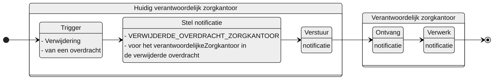

# VERWIJDERDE_OVERDRACHT_ZORGKANTOOR

## Documentatie

Notificatie aan het verantwoordelijke zorgkantoor dat als verantwoordelijk zorgkantoor is geregistreerd in de overdracht die is verwijderd

Het nieuw verantwoordelijke zorgkantoor is daarmee op de hoogte gesteld dat de dossieroverdracht van een client ongedaan is gemaakt. 

## Aanleiding
**De trigger voor de notificatie is:** 

> een verwijdering van een Overdracht in het Bemiddelingsregister

## Instructie
**Stel notificatie op voor:** 
> het zorgkantoor dat geregistreerd is onder verantwoordelijke zorgkantoor in de verwijderde overdracht.

## Type
Het type-notificatie: 
> VERPLICHT

## Schematisch




## Inhoud van de notificatie

| Variabele | Waarde | Voorbeeld | 
| :-- | :-- | :-- |
| timestamp | {timestamp} | ```"timestamp": "2024-07-02T00:00:00Z"``` | 
| afzenderIDType | "UZOVI" | ```"afzenderIDType": "UZOVI"``` |
| afzenderID | {uzovi-code ontvanger} | ```"afzenderID": "5050"``` |
| ontvangerIDType | "UZOVI" | ```"ontvangerIDType": "UZOVI"``` |
| ontvangerID | {uzovi-code ontvanger} | ```"ontvangerID": "5151"``` |
| ontvangerKenmerk | NULL | |
| eventType | "VERWIJDERDE_OVERDRACHT_ZORGKANTOOR" | ```"eventType": "VERWIJDERDE_OVERDRACHT_ZORGKANTOOR"``` |
| subjectList |  | ```"subjectList": [{```|
| ../subject | "Overdracht/{overdrachtID}" | "subject": "Overdracht/ef88ce35-58fa-4e6d-ac7a-6e298dd211d6"|
| ../recordID | "Overdracht/{overdrachtID}" | "recordID": "Overdracht/ef88ce35-58fa-4e6d-ac7a-6e298dd211d6" |
| | | ```}]``` | 


## Andere notificaties Bemiddelingsregister
[Andere notificaties Bemiddelingsregister](README.md)

## Meer informatie over Notificaties

Meer informatie over notificeren in het [Afsprakenstelsel iWlz](https://wlz.atlassian.net/wiki/x/5AlgAQ?atlOrigin=eyJpIjoiNzMyN2E3MjM3YjQwNGQ4MmFkZDgwNWY0ZmE0MDIzMGEiLCJwIjoiYyJ9): [link](https://wlz.atlassian.net/wiki/x/5AlgAQ?atlOrigin=eyJpIjoiNzMyN2E3MjM3YjQwNGQ4MmFkZDgwNWY0ZmE0MDIzMGEiLCJwIjoiYyJ9)
