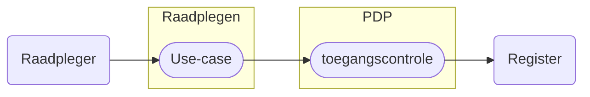

# Raadplegen Bemiddelingsregister

Het raadplegen van het Bemiddelingsregister is gebonden aan voorwaarden. De raadpleger moet bevoegd zijn én het vastgestelde raadpleegpatroon volgen. Dit patroon is essentieel voor het valideren van de toestemming. 

Als het patroon niet wordt gevolgd — bijvoorbeeld door ontbrekende autorisatie, onjuiste of incomplete input, of het opvragen van ongeoorloofde gegevens — wordt de toegang geweigerd of het resultaat beperkt.

Use-cases beschrijven hoe een deelnemer het register correct raadpleegt. Per use-case zijn er toegangscontroles beschreven zodat de verbinding met de bijbehorende autorisatie en de benodigde policy gemaakt kan worden. 

Meer informatie over de structuur van het raadplegen en het valideren ervan is te lezen in het [Afsprakenstelsel iWlz - Raadplegen](https://wlz.atlassian.net/wiki/x/KgpgAQ)

## Use-cases raadplegen Bemiddelingsregister

De use-cases voor het raadplegen van het Bemiddelingsregister per rol en bijbehorende beschrijving van de toegangscontrole door de PDP[^1]. 

Kies een use-case voor de beschrijving van het raadplegen of controleren van de toegang van die raadpleging.

### CIZ
| Rol | toelichting | raadplegen | toegangscontrole |
| :-- |:-- | :-- | :-- |
| [informerend](/gql-query/ciz/README.md#ciz---notificatie) | Het CIZ informeert betrokken zorgkantoren over wijzigingen van een Wlz Indicatie | | |

### Zorgaanbieder
| Rol | toelichting | raadplegen | toegangscontrole |
| :-- |:-- | :-- | :-- |
| [uitvoerend](/gql-query/zorgaanbieder/README.md#zorgaanbieder---uitvoerend) | Een zorgaanbieder die betrokken is bij het leveren van zorg wil de ***eigen*** bemiddelingspecificatie (eigen toewijzing) raadplegen.| [UCBR-0001-raadplegen](/raadplegen/zorgaanbieder/UCBR-0001-raadplegen.md) | [UCBR-0001-toegangscontrole](/raadplegen/zorgaanbieder/UCBR-0001-toegangscontrole.md) |
| [informatief](/gql-query/zorgaanbieder/README.md#zorgaanbieder---uitvoerend) | Een zorgaanbieder die betrokken is bij het leveren van zorg wil de bemiddelingspecificatie(s) raadplegen van de ***andere*** betrokken aanbieder(s). (De overlappende bemiddelingspecficatie(s) of informatieve zorgtoewijzing(en))  | | |
| [regiehouder](/gql-query/zorgaanbieder/README.md#zorgaanbieder---regiehouder) | Een zorgaanbieder die verantwoordelijk is voor de uitvoering van de zorg | | |

### Zorgaanbieder
| Rol | toelichting | raadplegen | toegangscontrole |
| :-- |:-- | :-- | :-- |
| [verantwoordelijk](/gql-query/zorgkantoor/README.md#zorgkantoor---verantwoordelijk) | Een zorgkantoor die verantwoordelijk is van de client (i.c.m. de Wlz Indicatie) en zorgt voor de registratie van die gegevens in het bemiddelingsregister |  | | 
| [uitvoerend](/gql-query/zorgkantoor/README.md#zorgkantoor---uitvoerend) | Een zorgkantoor dat uitvoerend is betrokken bij de uitvoering van zorg i.v.m. zorg uit een andere regio |  | |
| [nieuw verantwoordelijk](/gql-query/zorgkantoor/README.md#zorgkantoor---nieuw-verantwoordelijk) | Het zorgkantoor dat de client krijgt overgedragen van het huidige verantwoordelijk zorgkantoor | | |