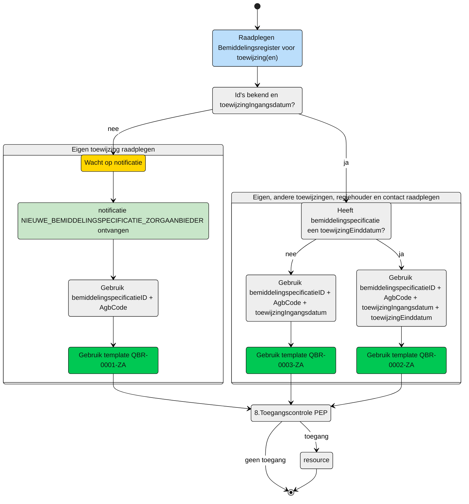

```mermaid
---
config:
  theme: neutral
  look: classic
---
stateDiagram
    [*] --> raadplegen
    state idAvailable <<choice>>
    raadplegen --> idAvailable
    idAvailable --> notifyWait: nee
    state eigen {
      notifyWait --> notifyReceive
      notifyReceive --> QBR0001ZAiq
      QBR0001ZAiq --> QBR0001ZA
    }

    QBR0001ZA --> PEP
    
    state einddatum <<choice>>
    idAvailable --> einddatum: ja
    state andere {
      einddatum --> QBR0003ZAiq: nee
      einddatum --> QBR0002ZAiq: ja
      QBR0003ZAiq --> QBR0003ZA
      QBR0002ZAiq --> QBR0002ZA
    }
    QBR0003ZA --> PEP
    QBR0002ZA --> PEP 
    PEP --> [*]: geen toegang
    PEP --> resource: toegang
    resource --> [*]


    raadplegen: Raadplegen Bemiddelingsregister voor toewijzing(en)
    eigen: Eigen toewijzing raadplegen
    andere: Eigen, andere toewijzingen, regiehouder en contact raadplegen
    idAvailable: Id's bekend en toewijzingIngangsdatum?
    notifyWait: Wacht op notificatie
    notifyReceive: notificatie NIEUWE_BEMIDDELINGSPECIFICATIE_ZORGAANBIEDER ontvangen
    einddatum: Heeft bemiddelingspecificatie een toewijzingEinddatum?
    QBR0001ZAiq: Gebruik bemiddelingspecificatieID + AgbCode
    QBR0001ZA: Gebruik template QBR-0001-ZA
    QBR0002ZAiq: Gebruik bemiddelingspecificatieID + AgbCode + toewijzingIngangsdatum + toewijzingEinddatum
    QBR0002ZA: Gebruik template QBR-0002-ZA
    QBR0003ZAiq: Gebruik bemiddelingspecificatieID + AgbCode + toewijzingIngangsdatum
    QBR0003ZA: Gebruik template QBR-0003-ZA
        PEP: 8.Toegangscontrole PEP

  style notifyWait fill:#FFD600
  style raadplegen fill:#BBDEFB,color:none
  style notifyReceive,haalData,inputQuery fill:#C8E6C9
  style QBR0001ZA,QBR0002ZA,QBR0003ZA fill:#00C853
```