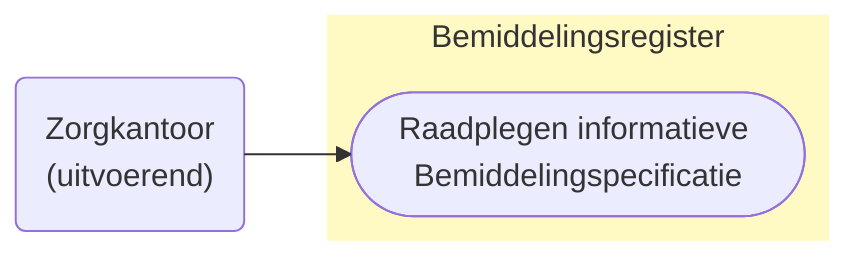
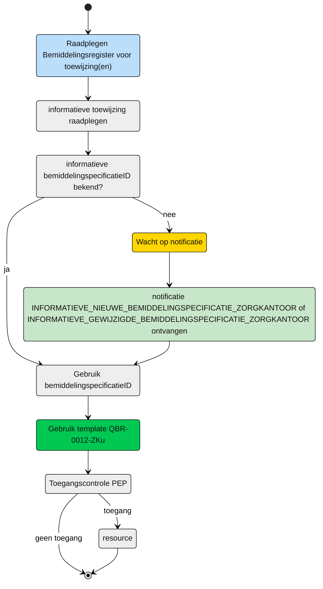

# Direct raadplegen van de **informatieve** Bemiddelingspecificatie door het (bovenregionaal) uitvoerend zorgkantoor n.a.v. Infomatieve notificaties (UCBR-0012) 

## **Use Case Beschrijving**  
**Titel:** Raadplegen van de **informatieve** Bemiddelingspecificatie door het (bovenregionaal) uitvoerend zorgkantoor n.a.v. Informatieve notificaties.  
**Actoren:** Zorgkantoor betrokken bij de levering van zorg aan een cliënt uit een andere regio.   

### Precondities:
- De Bemiddelingspecificatie is opgenomen in het Bemiddelingsregister.
- Het zorgkantoor is betrokken bij de levering van zorg aan de cliënt door de registratie van een bemiddelingspecificatie door het verantwoordelijk zorgkantoor.

### Autorisatie:
Een uitvoerend zorgkantoor mag voor het toeleiden van de cliënt de (informatieve) toewijzingen (Bemiddelingspecificaties) van andere zorgkantoren raadplegen. 
- Volledige autorisatieregel: [BRA0007](https://informatiemodel.istandaarden.nl/informatiemodel/iwlz/netwerk/bemiddelingsregister-1/regels/autorisatieregel/bra0007/) 
- Autorisatiematrix: [BRA0007](../autorisatiematrix_bemiddelingsregister.md)

**Trigger:**
- Een zorgkantoor wil de **informatieve** bemiddelingsspecificatie of aanvullende cliënt gegevens raadplegen voor het leveren van zorg aan een cliënt.

## Query-template beschrijving

| **Query ID** | **Beschrijving** | **Verplichte input** | **resultaat** |
|---|---|---|---|
| [**QBR-0012-ZKu**](/gql-query/zorgkantoor/QBR-0012-ZKu.graphql) | Op basis van de (ontvangen) bemiddelingspecificatieID, de Bemiddelingspecificatie, Bemiddeling en Cliënt gegevens raadplegen | `bemiddelingspecificatieID` | Bemiddelingspecificatie /  Bemiddeling / Client |

## **Proces raadplegen**

Een bovenregionaal zorgkantoor wil op basis van de informatieve notificaties, [informatieve_nieuwe_bemiddelingspecificatie_zorgkantoor](../../notificaties/informatieve_nieuwe_bemiddelingspecificatie_zorgkantoor.md) en 
[informatieve_gewijzigde_bemiddelingspecificatie_zorgkantoor](../../notificaties/informatieve_gewijzigde_bemiddelingspecificatie_zorgkantoor.md) de betreffende informatie raadplegen. 

### Schematisch:

| # | Toelichting |
| --: | :-- |
| 1. | *Start* raadplegen **informatieve** bemiddelingspecificatie | 
| 2. | Is de **`bemiddelingspecificatieID`** bekend?   - **Ja** →  Ga verder naar stap 6   - **Nee** → Wacht op notificatie [informatieve_nieuwe_bemiddelingspecificatie_zorgkantoor](../../notificaties/informatieve_nieuwe_bemiddelingspecificatie_zorgkantoor.md) of [informatieve_gewijzigde_bemiddelingspecificatie_zorgkantoor](../../notificaties/informatieve_gewijzigde_bemiddelingspecificatie_zorgkantoor.md)   | 
| 4. | Notificatie is ontvangen | 
| 5. | Gebruik de informatie uit de notificatie voor het raadplegen van het Bemiddelingsregister |
| 6. | Het zorgkantoor vult de verplichte **`bemiddelingspecificatieID`** in query-template [QBR-0012-ZKu.graphql](/gql-query/zorgkantoor/QBR-0012-ZKu.graphql) en initieert een raadpleging van de bemiddelingspecificatie in het Bemiddelingsregister. | 
| 7. | Het zorgkantoor stuurt Graphql-request + Access-token naar het Policy Enforcement Point (PEP) |
| 8. | De PEP voert de [toegangscontrole](UCBR-0012-toegangscontrole.md) uit en stuurt bij toegang het request door naar het Bemiddelingsregister. |
| 9. | Het zorgkantoor ontvangt response van de PEP (bij ongeldig verzoek) of vanuit het Bemiddelingsregister (resource) |
| 10. | *Einde proces* | 

---

Ga naar beschrijving van de bijbehorende [toegangscontrole](UCBR-0012-toegangscontrole.md)  |  Terug naar [Raadplegen](/raadplegen/README.md)
