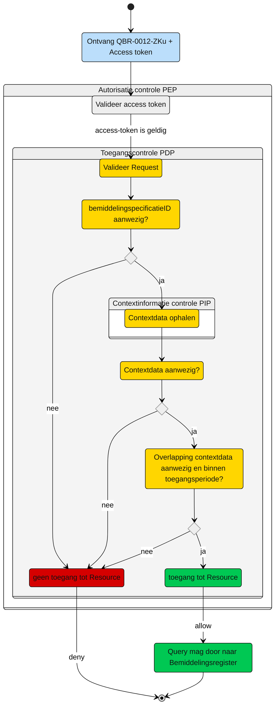

# Toegangscontrole: Raadplegen van de **informatieve** Bemiddelingspecificatie door het (bovenregionaal) uitvoerend zorgkantoor (UCBR-0012)  

Beschrijving van de **toegangscontrole** door de Policy Decision Point (PDP) en indien van toepassing Policy Information Point (PIP).

N.b. Het valideren van de Acces-token door de PEP is geen onderdeel van de ze beschrijving. Zie daarvoor het [Afsprakenstelsel iWlz - nID netwerkstelsel - 5. Policy Enforcement Point.](https://wlz.atlassian.net/wiki/spaces/IWLZAS/pages/229441537/nID+netwerkstelsel#5.-Policy-Enforcement-Point-(PEP))

## Toegangscontrole PDP
### Subject
- **Entiteit:** Zorgkantoor (bovenregionaal)
- **Kenmerk:** In bezit van een access-token met daarin de eigen `uzovicode`


### **Action**
- **Type:** `raadplegen` (read)
- **Omschrijving:** Uitvoeren van GraphQL-query [`QBR-0012-ZKu.graphql`](/gql-query/zorgkantoor/QBR-0012-ZKu.graphql) op het bemiddelingsregister door een zorgkantoor.


### **Resource**
- **Type:** `Bemiddelingsregister`
- **ID:** `bemiddelingspecificatieID`
- **Beperking:** Alleen toegang tot gegevens waarvoor het zorgkantoor een toewijzing heeft die overlap heeft met de geraadpleegde toewijzing
- **Inhoud:** Alleen de nodes Bemiddelingspecificatie en de gerelateerde Bemiddeling en Client die horen bij de opgevraagde Bemiddelingspecificatie, mogen direct worden opgevraagd.


### **Context**

**Query-parameters vereist:** De `bemiddelingspecificatieID` moet aanwezig zijn in de query

**Toegangsvoorwaarde:**  

Er is alleen toegang als aan alle volgende voorwaarden is voldaan:

1. Ophalen van benodigde context data (PIP)
    Input:
    - `bemiddelingspecificatieID` uit de raadpleeg-query
    - `uzoviCode` uit de accesstoken

    ```graphQL
    query PIPcontextBSdata(
      $bemiddelingspecificatieID: UUID! # bemiddelingspecificatieID uit initiele raadpleging
      $tokenUzovi: String!
    ) {
      # de opvraagde bemiddelingspecificatie
      bemiddelingspecificatie(
        where: { bemiddelingspecificatieID: { eq: $bemiddelingspecificatieID } }
      ) {
        bemiddelingspecificatieID
        toewijzingIngangsdatum
        toewijzingEinddatum
        vaststellingMoment
        bemiddeling {
          # de bemiddelingspecificaties van het raadplegende zorgkantoor
          bemiddelingspecificatie(
            where: { uitvoerendZorgkantoor: { eq: $tokenUzovi } }
          ) {
            toewijzingIngangsdatum
            toewijzingEinddatum
            vaststellingMoment
          }
        }
      }
    }
    ```

2. Bepalen toegang op basis van de verkregen context-data uit stap 1.

    De beoordeling gaat op basis van de ontvangen contextdata en zal plaatsvinden op basis van de (REGO) policy-beoordeling door de PDP. De policy zal de volgende afweging moeten doorlopen om te bepalen of het raadplegende zorgkantoor toegang krijgt tot de opgevraagde Bemiddelingspecificatie.

    Op basis van de context-data uit stap 1, is er:

    1. **Geen enkele** `Bemiddelingspecificatie` voor het raadplegende zorgkantoor in de contextdata.   
      Resultaat: **Geen toegang**
    2. **Tenminste 1** `Bemiddelingspecificatie` voor het raadplegende zorgkantoor in de contextdata moet voldoen aan de volgende overlap-voorwaarden.  
      Er moet beoordeeld worden of tenminste 1 `Bemiddelingspecificatie` overlapt heeft met de te raadplegen `Bemiddelingspecificatie` waarvan:

        1. de `eigen.bspec.toewijzingIngangsdatum` *kleiner of gelijk* is aan de `opgevraagde.bspec.toewijzingEinddatum` ***of***  
          de `eigen.bspec.vaststellingsmoment` *kleiner of gelijk* is aan de `opgevraagde.bspec.toewijzingeinddatum`;  
          **èn**
        2. de `eigen.bspec.toewijzingEinddatum` is null (leeg) ***of***  
          de `eigen.bspec.toewijzingEinddatum` *groter of gelijk* is aan de `opgevraagde.bspec.toewijzingIngangsdatum` ***of***  
          de `eigen.bspec.toewijzingEinddatum` *groter of gelijk* is aan de `opgevraagde.bspec.vaststellingMoment`  
          
      Voldoet geen van de gevonden `Bemiddelingspecificatie` van het raadplegende zorgkantoor aan de overlap voorwaarden?  
      Resultaat: **Geen toegang**
   
3. De toegang geldt t/m 31 mei van het jaar dat volgt op de einddatum van de eigen Bemiddelingspecificatie (`eigen.bspec.toewijzingEinddatum`).
   
   Van de overlappende `Bemiddelingspecificatie`: 
    1. is er een `eigen.bspec.toewijzingEinddatum` is null (leeg) -> Resultaat: **Toegang** 
    2. Valt de datum van raadplegen *voor of op* 31 mei van het jaar dat volgt op de grootst gevonden `eigen.bspec.toewijzingEinddatum` -> Resultaat: **Toegang**
   
   Voldoet geen van de gevonden `Bemiddelingspecificatie` van het raadplegende zorgkantoor aan de toegangs voorwaarden?  
   Resultaat: **Geen toegang**


### Resultaat

Toegang tot het Bemiddelingsregister via query [`QBR-0004-ZKu.graphql`](/gql-query/zorgkantoor/QBR-0004-ZKu.graphql) is **alleen toegestaan** als:

- Parameter **`bemiddelingspecificatieID`** is meegegeven in de query
- De access-token bevat een geldige **`uzovicode`**
- De in de query meegegeven `uzovicode` komt overeen met de `uzovicode` in de access-token; 
- de PIP raadpleging context-data oplevert die volgens de gestelde voorwaarden toegang geeft.

Als aan alle voorwaarden is voldaan, mogen de nodes `Bemiddelingspecificatie`, `Bemiddeling` en `Client` die horen bij deze `Bemiddelingspecificatie` direct worden opgevraagd.


## Toegangscontrole-flows Zorgkantoor: QBR-0012-ZKu.graphql

Beschrijving van het autorisatieproces door de PEP.

### **schematisch:**




| # | Toelichting |
| --: | :-- |
| 1. |Ontvangst GraphQL-request + access-token door **PEP** |
| 2. |De **PEP** valideert de access-token en geeft na goedkeur het request door aan de PDP |
| 3. |De **PDP** voert de volgende stappen uit:<br/>1. controleer of het request voldoet aan de template en er geen ongeoorloofde gegevens worden opgevraagd.<br/>2. Aanwezigheid van de verplichte parameters in het request;<br/>3. Laat **PIP** context-data ophalen;<br/>4. Beoordeel de aanwezigheid van de context-data en de voorwaarden van toegang. <br/><br/>Is aan alle voorwaarden voldaan?<br/> - **Ja** →  Ga verder naar stap 4<br/>- **Nee** → *Einde proces (geen toegang.)*   |
| 4. | Het zorgkantoor krijgt toegang tot het bemiddelingsregister.|
| 5. | *Einde* |


## Toegangscontrole PIP:
```gql
nvt

```


---
Ga naar [UC beschrijving raadplegen](UCBR-0012-raadplegen.md) -- Terug naar [Raadplegen](/raadplegen/README.md)
