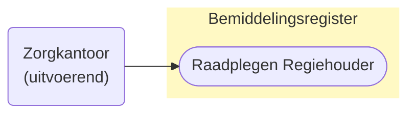
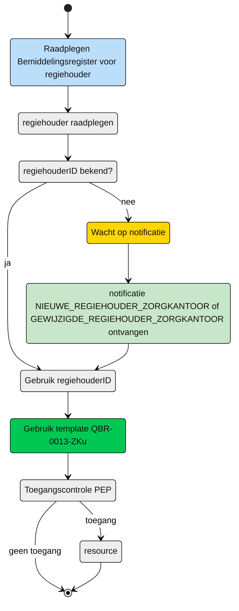

# Direct raadplegen van de Regiehouder door het (bovenregionaal) uitvoerend zorgkantoor n.a.v. Informatieve notificaties (UCBR-0013) 

## **Use Case Beschrijving**  
**Titel:** Direct raadplegen van de **Regiehouder** door het (bovenregionaal) uitvoerend zorgkantoor n.a.v. Informatieve notificaties (UCBR-0013)  
**Actoren:** Zorgkantoor betrokken bij de levering van zorg aan een cliënt uit een andere regio.   

### Precondities:
- De Regiehouder is opgenomen in het Bemiddelingsregister.
- Het zorgkantoor is betrokken bij de levering van zorg aan de cliënt door de registratie van een bemiddelingspecificatie door het verantwoordelijk zorgkantoor die bij dezelfde Bemiddeling hoort als de te raadplegen Regiehouder.

### Autorisatie:
Een zorgkantoor mag voor het toeleiden van de cliënt de Regiehouders raadplegen wanneer die Regiehouders bij dezelfde Bemiddeling horen als de eigen Bemiddelingspecificatie. 
- Volledige autorisatieregel: [BRA0009](https://informatiemodel.istandaarden.nl/informatiemodel/iwlz/netwerk/bemiddelingsregister-1/regels/autorisatieregel/bra0009/)
- Autorisatiematrix: [BRA0009](../autorisatiematrix_bemiddelingsregister.md)

**Trigger:**
- Een zorgkantoor wil de **regiehouder** raadplegen voor het leveren van zorg aan een cliënt.

## Query-template beschrijving

| **Query ID** | **Beschrijving** | **Verplichte input** | **resultaat** |
|---|---|---|---|
| [**QBR-0013-ZKu**](/gql-query/zorgkantoor/QBR-0013-ZKu.graphql) | Op basis van de (ontvangen) notificatie en de eigen Uzovicode de Regiehouder raadplegen | `regiehouderID`, `bemiddelingspecificatieID`, eigen `uzoviCode` | Regiehouder (en optioneel Bemiddeling, eigen Bemiddelingspecificatie en Client) |

## **Proces raadplegen**

Een bovenregionaal zorgkantoor wil op basis van de informatieve notificaties, [nieuwe_regiehouder_zorgkantoor](../../notificaties/nieuwe_regiehouder_zorgkantoor.md) en 
[gewijzigde_regiehouder_zorgkantoor](../../notificaties/gewijzigde_regiehouder_zorgkantoor.md) de betreffende informatie raadplegen. 

### Schematisch:

| # | Toelichting |
| --: | :-- |
| 1. | *Start* raadplegen regiehouder | 
| 2. | Is de **`regiehouderID`** bekend?   - **Ja** →  Ga verder naar stap 6   - **Nee** → Wacht op notificatie [nieuwe_regiehouder_zorgkantoor](../../notificaties/nieuwe_regiehouder_zorgkantoor.md) of [gewijzigde_regiehouder_zorgkantoor](../../notificaties/gewijzigde_regiehouder_zorgkantoor.md)   | 
| 4. | Notificatie is ontvangen | 
| 5. | Gebruik de informatie uit de notificatie voor het raadplegen van het bemiddelingsregister |
| 6. | Het zorgkantoor vult de verplichte **`regiehouderID`** en **`bemiddelingspecificatieID`** in query-template [QBR-0013-ZKu.graphql](/gql-query/zorgkantoor/QBR-0013-ZKu.graphql) en initieert een raadpleging van de regiehouder in het Bemiddelingsregister. | 
| 7. | Het zorgkantoor stuurt Graphql-request + Access-token naar het Policy Enforcement Point (PEP) |
| 8. | De PEP voert de [toegangscontrole](UCBR-0013-toegangscontrole.md) uit en stuurt bij toegang het request door naar het Bemiddelingsregister. |
| 9. | Het zorgkantoor ontvangt response van de PEP (bij ongeldig verzoek) of vanuit het Bemiddelingsregister (resource) |
| 10. | *Einde proces* | 

---

Ga naar beschrijving van de bijbehorende [toegangscontrole](UCBR-0013-toegangscontrole.md)  |  Terug naar [Raadplegen](/raadplegen/README.md)
