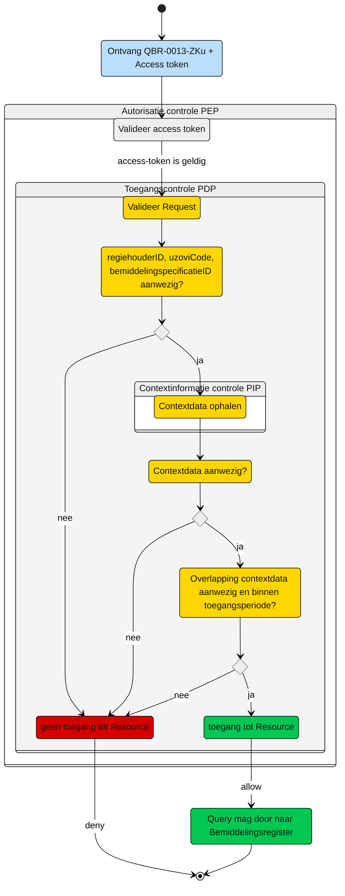

# Toegangscontrole: Raadplegen van de Regiehouder door het (bovenregionaal) uitvoerend zorgkantoor (UCBR-0013)  

Beschrijving van de **toegangscontrole** door de Policy Decision Point (PDP) en indien van toepassing Policy Information Point (PIP).

N.b. Het valideren van de Acces-token door de PEP is geen onderdeel van deze beschrijving. Zie daarvoor het [Afsprakenstelsel iWlz - nID netwerkstelsel - 5. Policy Enforcement Point.](https://wlz.atlassian.net/wiki/spaces/IWLZAS/pages/229441537/nID+netwerkstelsel#5.-Policy-Enforcement-Point-(PEP))

## Toegangscontrole PDP
### Subject
- **Entiteit:** Zorgkantoor (bovenregionaal)
- **Kenmerk:** In bezit van een access-token met daarin de eigen `uzoviCode`


### **Action**
- **Type:** `raadplegen` (read)
- **Omschrijving:** Uitvoeren van GraphQL-query [`QBR-0013-ZKu.graphql`](/gql-query/zorgkantoor/QBR-0013-ZKu.graphql) op het Bemiddelingsregister door een zorgkantoor.


### **Resource**
- **Type:** `Bemiddelingsregister`
- **ID:** `regiehouderID`
- **Beperking:** Alleen toegang tot gegevens waarvoor het zorgkantoor een toewijzing heeft die overlap heeft met de geraadpleegde regiehouder
- **Inhoud:** Alleen de specifieke Bemiddelingspecificatie, de gerelateerde Bemiddeling en Client die horen bij de opgevraagde Regiehouder, mogen direct worden opgevraagd.


### **Context**
**Query-parameters vereist:** De `regiehouderID`, `bemiddelingspecificatieID` en `uzoviCode` moeten aanwezig zijn in de query

**Toegangsvoorwaarde:**  Er is alleen toegang als aan alle volgende voorwaarden is voldaan:

1. Ophalen van benodigde context data (PIP)
    Input:
    - `regiehouderID` - uit de raadpleeg-query
    - `uzoviCode` - uit de raadpleeg-query
    - `bemiddelingspecificatieID` - uit de raadpleeg-query  

    ```graphQL
    query PIPContextDataRegiehouder (
      $regiehouderID: UUID!             # uit de raadpleeg-query
      $uzovi: String!                   # uit de raadpleeg-query
      $bemiddelingspecificatieID: UUID! # uit de raadpleeg-query
    ) {
      regiehouder (where:  {
        regiehouderID:  {
            eq: $regiehouderID 
        }
      }) {
        regiehouderID
        ingangsdatum
        einddatum
        bemiddeling{
          bemiddelingspecificatie (where:  {
            and: [ {
                bemiddelingspecificatieID:  {
                  eq: $bemiddelingspecificatieID
                }
            }
            { uitvoerendZorgkantoor:  {
                eq: $uzovi
            }}]
          })  {
            bemiddelingspecificatieID
            toewijzingIngangsdatum
            toewijzingEinddatum
            vaststellingMoment
          }
        }
      }
    }
    ```

2. Bepalen toegang op basis van de verkregen context-data uit stap 1.

    De beoordeling gaat op basis van de ontvangen contextdata en zal plaatsvinden op basis van de (REGO) policy-beoordeling door de PDP. De policy zal de volgende afweging moeten doorlopen om te bepalen of het raadplegende zorgkantoor toegang krijgt tot de opgevraagde Regiehouder.

    Op basis van de context-data uit stap 1, is er:

    1. **Geen enkele** `Bemiddelingspecificatie` voor het raadplegende zorgkantoor in de contextdata.   
      Resultaat: **Geen toegang**
    2. De `Bemiddelingspecificatie` voor het raadplegende zorgkantoor in de contextdata moet voldoen aan de volgende overlap-voorwaarden.  
      Er moet beoordeeld worden of de `Bemiddelingspecificatie` overlap heeft met de te raadplegen `Regiehouder` waarvan:

        1. de `eigen.bspec.toewijzingIngangsdatum` *kleiner of gelijk* is aan de `opgevraagde.regiehouder.einddatum` ***of***  
          de `eigen.bspec.vaststellingsmoment` *kleiner of gelijk* is aan de `opgevraagde.regiehouder.einddatum`;  
          **èn**
        2. de `eigen.bspec.toewijzingEinddatum` is null (leeg) ***of***  
          de `eigen.bspec.toewijzingEinddatum` *groter of gelijk* is aan de `opgevraagde.regiehouder.ingangsdatum`  
          
      Voldoet **GEEN** van de gevonden `Bemiddelingspecificatie` van het raadplegende zorgkantoor aan de overlap voorwaarden?  
      Resultaat: **Geen toegang**
   
3. De toegang geldt t/m 31 mei van het jaar dat volgt op de einddatum van de eigen Bemiddelingspecificatie (`eigen.bspec.toewijzingEinddatum`).
   
   Van de overlappende `Bemiddelingspecificatie`: 
    1. is er een `eigen.bspec.toewijzingEinddatum` is null (leeg) -> Resultaat: **Toegang** 
    2. Valt de datum van raadplegen *voor of op* 31 mei van het jaar dat volgt op de grootst gevonden `eigen.bspec.toewijzingEinddatum` -> Resultaat: **Toegang**
   
   Voldoet **GEEN** van de `Bemiddelingspecificatie` van het raadplegende zorgkantoor aan de toegangsvoorwaarden?  
   Resultaat: **Geen toegang**


### Resultaat

Toegang tot het Bemiddelingsregister via query [`QBR-0013-ZKu.graphql`](/gql-query/zorgkantoor/QBR-0013-ZKu.graphql) is **alleen toegestaan** als:

- Parameters **`bemiddelingspecificatieID`**, **`uzoviCode`**, **`regiehouderID`** zijn meegegeven in de query
- De in de query meegegeven `uzoviCode` komt overeen met de `uzoviCode` in de access-token; 
- de PIP raadpleging context-data oplevert die volgens de gestelde voorwaarden toegang geeft.

Als aan alle voorwaarden is voldaan, mogen de `Regiehouder`, de specifieke `Bemiddelingspecificatie`, `Bemiddeling` en `Client` die horen bij deze `Regiehouder` direct worden opgevraagd.


## Toegangscontrole-flows Zorgkantoor: QBR-0013-ZKu.graphql

Beschrijving van het autorisatieproces door de PEP.

### **schematisch:**




| # | Toelichting |
| --: | :-- |
| 1. |Ontvangst GraphQL-request + access-token door **PEP** |
| 2. |De **PEP** valideert de access-token en geeft na goedkeur het request door aan de PDP |
| 3. |De **PDP** voert de volgende stappen uit:<br/>1. controleer of het request voldoet aan de template en er geen ongeoorloofde gegevens worden opgevraagd.<br/>2. Aanwezigheid van de verplichte parameters in het request;<br/>3. Of de **`uzovicode`** in request overeenkomt met de waarde in de **`access-token`**;<br/>4. Laat **PIP** context-data ophalen;<br/>5. Beoordeel de aanwezigheid van de context-data en de voorwaarden van toegang. <br/><br/>Is aan alle voorwaarden voldaan?<br/> - **Ja** →  Ga verder naar stap 4<br/>- **Nee** → *Einde proces (geen toegang.)*   |
| 4. | Het zorgkantoor krijgt toegang tot het bemiddelingsregister.|
| 5. | *Einde* |


---
Ga naar [UC beschrijving raadplegen](UCBR-0013-raadplegen.md) -- Terug naar [Raadplegen](/raadplegen/README.md)
