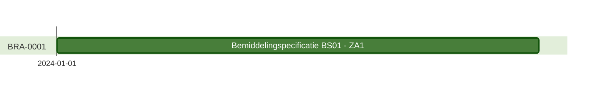

# Toegangsbeschrijving voor BRA0001
|                  |      |
| :--------------- | :--- |
| Autorisatieregel | BRA0001: Een zorgaanbieder mag voor het leveren van zorg aan een cliënt de eigen toewijzing raadplegen. |
| Raadpleger       | Zorgaanbieder (1)  |

##

## **Toegang voor de raadpleger werkt als volgt:**

**Casus**
- Zorgkantoor ZK1 registreert een Bemiddelingspecificatie BS1 voor Zorgaanbieder ZA1 e
- Zorgaanbieder ZA1 is gecontracteerd door Zorgkantoor ZK1
- Zorgaanbieder ZA1 wil de eigen Bemiddelingspecificatie BS1 raadplegen.
- Het moment van raadplegen is **NIET** van invloed op het raadplegen van Bemiddelingspecificatie BS1 door Zorgaanbieder ZA1

**Zorgaanbieder ZA1 mag:**  
1. Bemiddelingspecificatie BS1 direct raadplegen na registratie in het register
2. Bemiddelingspecificatie BS1 blijven raadplegen zolang de informatie in het register beschikbaar is
3. Direct ook de Bemiddeling en de Client raadplegen waar de Bemiddelingspecificatie BS1 bij hoort 

---
[terug naar overzicht](./README.md)