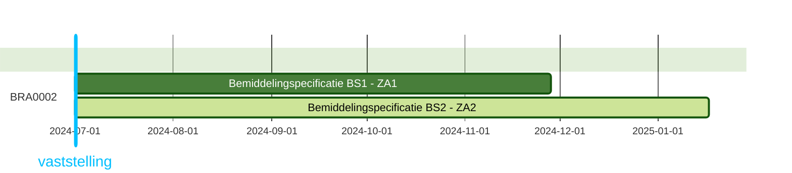
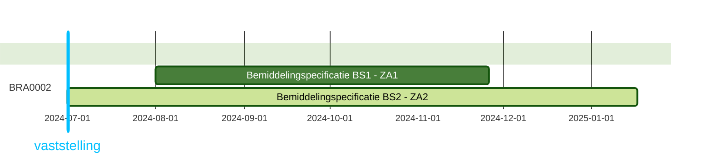
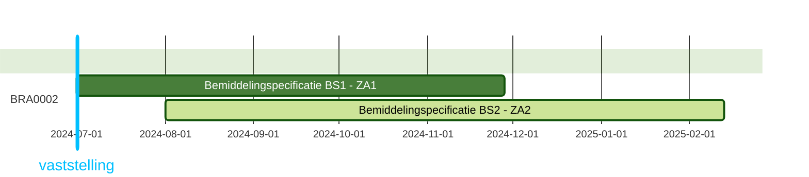
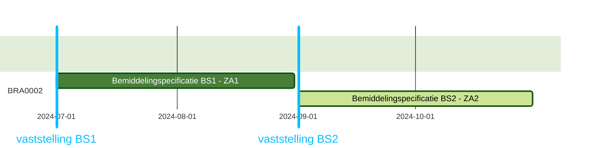

# Toegangsbeschrijving voor BRA0002
|                  |      |
| :--------------- | :--- |
| Autorisatieregel | BRA0002: Een zorgaanbieder mag voor het leveren van zorg aan een cliënt de (informatieve) toewijzingen raadplegen die niet van deze zorgaanbieder zijn. |
| Raadpleger       | Zorgaanbieder (1)  |

##

## **Toegang voor de raadpleger werkt als volgt:**

**Casus**
- Zorgkantoor ZK1 registreert een Bemiddelingspecificatie BS1 voor Zorgaanbieder ZA1 en een Bemiddelingspecificatie BS2 voor Zorgaanbieder ZA2
- Zorgaanbieder ZA1 en Zorgaanbieder ZA2 zijn beide gecontracteerd door Zorgkantoor ZK1
- Zorgaanbieder ZA1 wil de Bemiddelingspecificatie BS2 van Zorgaanbieder ZA2 raadplegen.
- Het moment van raadplegen is **WEL** van invloed op het raadplegen van Bemiddelingspecificatie BS2

**Momenten van Raadplegen en overlap**  
De datums van de eigen Bemiddelingspecificatie BS1 en Bemiddelingspecificatie BS2 zijn bepalend voor de toegang tot Bemiddelingspecificatie BS2. Dit bepaalt onder andere of er overlap is tussen de twee Bemiddelingspecificaties. De overlap word bepaald op de volgende drie datumvelden: 
  - *Toewijzing ingangsdatum:* Eerste datum waarop de toegewezen zorg geleverd mag worden of het persoonsgebonden budget aangesproken mag worden.
  - *Toewijzing einddatum:* Laatste datum waarop de toegewezen zorg geleverd mag worden of het persoonsgebonden budget aangesproken mag worden.
  - *Vaststelling moment:* Datum en tijdstip waarop het zorgkantoor de toewijzing heeft vastgesteld. N.b. voor de overlapbepaling telt het datumdeel van het moment.

| Moment | Periode | 
| :----- | :------ | 
| M-1 | Direct na registratie maar voor of op 31 mei van het jaar dat volgt op de eigen einddatum (2025-05-31) | 
| M-2 | Na de ingangsdatum maar voor of op de einddatum |
| M-3 | Na het vaststellingsmoment maar voor of op de einddatum |
| M-4 | Na de einddatum maar voor of op 31 mei van het jaar dat volgt op de eigen einddatum (2025-05-31) |
| M-5 | Na 31 mei van het jaar dat volgt op de eigen einddatum (2025-05-31) | 

### **Situatie 1: Toewijzing Ingangsdatum = Vaststellingsmoment**

| BS   | ZA   | Toewijzing ingangsdatum | Toewijzing einddatum | Vaststelling moment | Registratie moment |
| :--- | :--- | :---------------------- | :------------------- | :------------------ | :----------------- |
| BS1  | ZA1  | 2024-07-01              | 2024-11-25           | 2024-07-01          | 2024-07-01         |
| BS2  | ZA2  | 2024-07-01              |                      | 2024-07-01          | 2024-07-01         |

**Toegang per raadpleegmoment**

| Moment | Voorbeeld datum raadpleging | Inzage tot BS2 | Toelichting |
| :----- | :-------------------------- | :------------- | :---------- |
| M-1 | 2024-07-01 | Ja  | De eigen Bemiddelingspecificatie BS1 overlapt op dat moment met BS2 en het moment ligt voor 31 mei van het jaar dat volgt op de eigen einddatum |
| M-2 | 2024-08-17 | Ja  | De eigen Bemiddelingspecificatie BS1 overlapt op dat moment met BS2 en het moment ligt voor 31 mei van het jaar dat volgt op de eigen einddatum |
| M-3 | 2024-08-17 | Ja  | De eigen Bemiddelingspecificatie BS1 overlapt op dat moment met BS2 en het moment ligt voor 31 mei van het jaar dat volgt op de eigen einddatum |
| M-4 | 2025-03-17 | Ja  | De eigen Bemiddelingspecificatie BS1 is wel beëindigd maar het moment ligt **voor** 31 mei van het jaar dat volgt op de eigen einddatum |
| M-5 | 2025-07-01 | Nee | De eigen Bemiddelingspecificatie BS1 is beëindigd en het moment ligt **na** 31 mei van het jaar dat volgt op de eigen einddatum |

### **Situatie 2a: Toewijzing Ingangsdatum <> Vaststellingsmoment**

| BS   | ZA   | Toewijzing ingangsdatum | Toewijzing einddatum | Vaststelling moment | Registratie moment |
| :--- | :--- | :---------------------- | :------------------- | :------------------ | :----------------- |
| BS1  | ZA1  | *2024-**08**-01*        | 2024-11-25           | 2024-07-01          | 2024-07-01         |
| BS2  | ZA2  | 2024-07-01              |                      | 2024-07-01          | 2024-07-01         |

**Toegang per raadpleegmoment**

| Moment | Voorbeeld datum raadpleging | Inzage tot BS2 | Toelichting |
| :----- | :-------------------------- | :------------- | :---------- |
| M-1 | 2024-07-01 | Ja  | De eigen Bemiddelingspecificatie BS1 overlapt op dat moment met BS2 op basis van het vaststellingsmoment van BS1 en het moment ligt voor 31 mei van het jaar dat volgt op de eigen einddatum. Het vaststellingsmoment van BS1 is eerder dan de toewijzing ingangsdatum |
| M-2 | 2024-08-17 | Ja  | De eigen Bemiddelingspecificatie BS1 overlapt op dat moment met BS2 en het moment ligt voor 31 mei van het jaar dat volgt op de eigen einddatum |
| M-3 | 2024-08-17 | Ja  | De eigen Bemiddelingspecificatie BS1 overlapt op dat moment met BS2 en het moment ligt voor 31 mei van het jaar dat volgt op de eigen einddatum |
| M-4 | 2025-03-17 | Ja  | De eigen Bemiddelingspecificatie BS1 is wel beëindigd maar het moment ligt **voor** 31 mei van het jaar dat volgt op de eigen einddatum |
| M-5 | 2025-07-01 | Nee | De eigen Bemiddelingspecificatie BS1 is beëindigd en het moment ligt **na** 31 mei van het jaar dat volgt op de eigen einddatum |

### **Situatie 2b: Toewijzing Ingangsdatum <> Vaststellingsmoment**

| BS   | ZA   | Toewijzing ingangsdatum | Toewijzing einddatum | Vaststelling moment | Registratie moment |
| :--- | :--- | :---------------------- | :------------------- | :------------------ | :----------------- |
| BS1  | ZA1  | 2024-07-01              | 2024-11-25           | 2024-07-01          | 2024-07-01         |
| BS2  | ZA2  | *2024-**08**-01*        |                      | 2024-07-01          | 2024-07-01         |

**Toegang per raadpleegmoment**

| Moment | Voorbeeld datum raadpleging | Inzage tot BS2 | Toelichting |
| :----- | :-------------------------- | :------------- | :---------- |
| M-1 | 2024-07-01 | Ja  | De eigen Bemiddelingspecificatie BS1 overlapt op dat moment met BS2 op basis van het vaststellingsmoment van BS1 en het moment ligt voor 31 mei van het jaar dat volgt op de eigen einddatum. Het vaststellingsmoment van BS1 is eerder dan de toewijzing ingangsdatum |
| M-2 | 2024-08-17 | Ja  | De eigen Bemiddelingspecificatie BS1 overlapt op dat moment met BS2 en het moment ligt voor 31 mei van het jaar dat volgt op de eigen einddatum |
| M-3 | 2024-08-17 | Ja  | De eigen Bemiddelingspecificatie BS1 overlapt op dat moment met BS2 en het moment ligt voor 31 mei van het jaar dat volgt op de eigen einddatum |
| M-4 | 2025-03-17 | Ja  | De eigen Bemiddelingspecificatie BS1 is wel beëindigd maar het moment ligt **voor** 31 mei van het jaar dat volgt op de eigen einddatum |
| M-5 | 2025-07-01 | Nee | De eigen Bemiddelingspecificatie BS1 is beëindigd en het moment ligt **na** 31 mei van het jaar dat volgt op de eigen einddatum |

### Situatie 3: Geen overlap

| BS   | ZA   | Toewijzing ingangsdatum | Toewijzing einddatum | Vaststelling moment | Registratie moment |
| :--- | :--- | :---------------------- | :------------------- | :------------------ | :----------------- |
| BS1  | ZA1  | 2024-07-01              | 2024-08-31           | 2024-07-01          | 2024-07-01         |
| BS2  | ZA2  | 2024-09-01              |                      | 2024-09-01          | 2024-09-01         |

**Toegang per raadpleegmoment**

| Moment | Voorbeeld datum raadpleging | Inzage tot BS2 | Toelichting |
| :----- | :-------------------------- | :------------- | :---------- |
| M-1 | 2024-07-01 | Nee  | Er is geen overlap |
| M-2 | 2024-08-17 | Nee  | Er is geen overlap |
| M-3 | 2024-08-17 | Nee  | Er is geen overlap |
| M-4 | 2025-03-17 | Nee  | Er is geen overlap |
| M-5 | 2025-07-01 | Nee  | Er is geen overlap |

---
[terug naar overzicht](./README.md)